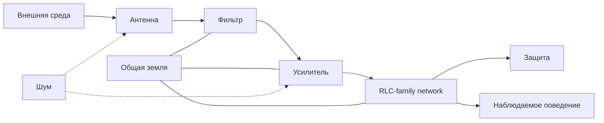

# RLC-FAMILY-2 — Сигналы, связь и устойчивость семейных систем

> **Статус:** сатирическая псевдонаучная модель.  
> Физические формулы и термины заимствуются из электротехники, теории сигналов и теории управления; их «семейная» интерпретация намеренно абсурдна.

## 0. Расширение базовой модели

Первая часть RLC-family задаёт пассивное ядро:

$$
\text{мужчина}=C,\qquad
\text{женщина}=L,\qquad
\text{ребёнок}=R.
$$

Одного RLC-контура недостаточно, чтобы описывать связь семьи с внешним миром. Поэтому вводится расширенная сигнальная архитектура:

Внутри сети остаются $R$, $L$ и $C$, но теперь появляются:

- ток взаимодействия $I$;
- напряжение побуждения $U$;
- проводимость канала;
- общая земля;
- внешняя антенна;
- фильтр;
- усилитель;
- шум;
- обратная связь;
- защитные элементы.

---

## 1. Ток семейного взаимодействия

### Определение SIG1

**Семейный ток $I$** — фактический поток взаимодействия между элементами системы.

К нему относятся не намерения сами по себе, а наблюдаемая передача:

- внимания;
- слов;
- действий;
- заботы;
- денег;
- бытовой работы;
- совместно затраченного времени.

В линейном приближении:

$$
I=\frac{U}{Z}.
$$

Здесь $U$ — побуждающее напряжение, а $Z$ — полный импеданс семейной сети.

### Следствие SIG1.1

Большое напряжение ещё не означает большого взаимодействия.

При

$$
|Z|\gg 1
$$

даже значительное $U$ может сопровождаться малым током.

Отсюда первый закон расширенной теории:

> **Напряжение — это ещё не отношения. Отношения начинаются, когда пошёл ток.**

---

## 2. Проводник и канал связи

### Определение CHAN1

**Проводник** — физический или информационный канал, по которому может протекать семейный ток.

Примеры:

- разговор;
- сообщение;
- совместное действие;
- прикосновение;
- денежный перевод;
- распределение бытовых задач.

Идеальный проводник не искажает передаваемый сигнал.

Реальный семейный канал имеет сопротивление $R_c$, задержку $\tau$ и коэффициент передачи $K_c$.

Упрощённо:

$$
y(t)=K_c\,x(t-\tau)+n(t),
$$

где $n(t)$ — шум канала.

### Гипотеза CHAN1

При росте сопротивления канала одно и то же исходное сообщение требует большего напряжения для сохранения того же тока:

$$
U=I R_c.
$$

Бытовая формулировка:

> если с первого раза не услышали, система склонна увеличивать напряжение вместо ремонта канала.

---

## 3. Изоляция и личные границы

Изоляция ограничивает нежелательный ток между проводниками.

В модели это полезный элемент: она предотвращает короткое замыкание.

Однако при стремлении

$$
R_{\text{изоляции}}\rightarrow\infty
$$

обмен между подсистемами прекращается:

$$
I\rightarrow0.
$$

### Гипотеза INS1

Существует ненулевой оптимум изоляции:

- слишком малая изоляция создаёт паразитные токи;
- слишком большая превращает единую сеть в независимые контуры.

Следовательно, хорошие границы не эквивалентны отсутствию связи.

---

## 4. Общая земля

### Определение GND1

**Семейная земля** — общий опорный потенциал, относительно которого участники сравнивают состояния системы.

В бытовой интерпретации это:

- общие факты;
- заранее согласованные правила;
- разделяемые определения;
- проверяемые события;
- договорённости о том, что именно считается произошедшим.

Если два измерительных прибора используют разные точки отсчёта,

$$
U_A=V_A-V_{\text{GND},A},
$$

$$
U_B=V_B-V_{\text{GND},B},
$$

то при

$$
V_{\text{GND},A}\neq V_{\text{GND},B}
$$

их показания нельзя непосредственно сравнивать.

### Теорема GND1

**Отсутствие общей земли допускает устойчивый спор даже при исправных измерительных приборах.**

То есть оба участника могут корректно измерять своё напряжение и всё равно получать несовместимые результаты.

Бытовая формулировка:

> оба правы относительно своей земли.

---

## 5. Антенна

### Определение ANT1

**Антенна** — интерфейс семейного контура с внешним информационным полем.

Она принимает сигналы, генерируемые вне внутренней RLC-сети:

- мнения родственников;
- друзей;
- коллег;
- социальных сетей;
- рекламы;
- соседей;
- новостей;
- чужих семей.

Полученный сигнал можно представить как

$$
u_A(t)=h_A(t)*e(t),
$$

где $e(t)$ — внешнее поле, а $h_A(t)$ — характеристика приёмного тракта.

### Диаграмма направленности

В общем случае чувствительность зависит от направления:

$$
G=G(\theta,\varphi).
$$

Это позволяет существование систем, которые:

- отлично слышат родителей;
- прекрасно принимают друзей;
- уверенно принимают TikTok;
- почти не принимают партнёра, расположенного непосредственно перед антенной.

### Гипотеза ANT1

**Внутреннее возмущение может возникнуть без внутреннего источника, если коэффициент внешней связи достаточно велик.**

Упрощённо:

$$
U_{\text{in}}=U_{\text{family}}+K_A U_{\text{external}}.
$$

Даже при

$$
U_{\text{family}}=0
$$

получаем

$$
U_{\text{in}}\neq0
$$

при $K_AU_{\text{external}}\neq0$.

Экспериментальная формулировка:

> «У нас всё было нормально, пока антенна не поймала Instagram».

---

## 6. Внешний резонанс

Пусть собственная частота базового семейного контура равна

$$
\omega_0=\frac{1}{\sqrt{LC}}.
$$

Если внешний сигнал содержит компоненту

$$
\omega\approx\omega_0,
$$

его действие может оказаться непропорционально сильным.

Типичные узкополосные возбуждения:

- «Когда дети?»;
- «А ипотеку уже закрыли?»;
- «А вот у Маши муж...»;
- «Почему вы до сих пор снимаете?»;
- «А ваш уже умеет читать?».

### Гипотеза ANT2

Сила семейной реакции определяется не только мощностью внешнего сигнала, но и близостью его частоты к собственным модам системы.

Поэтому совершенно безобидная для одной семьи фраза способна войти в резонанс с другой.

---

## 7. Фильтр

### Определение FILT1

**Фильтр** — подсистема, определяющая, какая часть принятого внешнего сигнала попадёт во внутренний контур.

Передаточная функция:

$$
H(\omega)=\frac{Y(\omega)}{X(\omega)}.
$$

В семейной интерпретации фильтр отвечает за:

- проверку источника;
- отделение факта от мнения;
- подавление слухов;
- удаление нерелевантных сравнений;
- критическое мышление.

Хороший фильтр должен, например, пропускать сигнал:

> «Завтра отключат воду с 10:00 до 16:00».

и подавлять:

> «Нормальные люди к вашему возрасту уже должны...»

### Гипотеза FILT1

Чем выше подавление нерелевантной полосы, тем слабее внешнее поле возбуждает внутренние моды семейной системы.

---

## 8. Шум и отношение сигнал/шум

Полный входной сигнал:

$$
x(t)=s(t)+n(t),
$$

где $s(t)$ — полезный сигнал, $n(t)$ — шум.

Определим:

$$
\mathrm{SNR}=
\frac{P_s}{P_n}.
$$

К шуму относятся:

- додумывание;
- неверно восстановленный контекст;
- слухи;
- случайные комментарии;
- алгоритмически усиленная ерунда;
- «я по твоему тону всё понял».

### Теорема NOISE1

При

$$
\mathrm{SNR}\ll1
$$

реакция системы определяется преимущественно шумом, а не исходным сообщением.

Бытовая формулировка:

> при достаточно плохом SNR уже неважно, что именно было сказано.

---

## 9. Усилитель

### Определение AMP1

**Усилитель** преобразует входной сигнал в более мощное воздействие:

$$
U_{\text{out}}=A\,U_{\text{in}}.
$$

В семейной системе коэффициент $A$ характеризует эмоциональное усиление.

При $A\approx1$ сообщение сохраняет масштаб.

При $A\gg1$ фраза:

> «Купи, пожалуйста, молоко»

после прохождения тракта может быть восстановлена как:

> «Ты вообще никогда ничего для этой семьи не делаешь».

Это не является ошибкой источника. Это усиление тракта.

---

## 10. Обратная связь

Пусть часть выходного сигнала возвращается на вход:

$$
U_{\text{fb}}=\beta U_{\text{out}}.
$$

Для системы с усилением $A$ замкнутый коэффициент имеет вид

$$
A_{\text{cl}}=
\frac{A}{1-A\beta}.
$$

При приближении

$$
A\beta\rightarrow1
$$

реакция резко возрастает.

### Гипотеза FB1

**Ревность, взаимные упрёки и некоторые виды спора могут моделироваться положительной обратной связью.**

Малое начальное возмущение:

$$
\delta U_0
$$

последовательно усиливается:

$$
\delta U_0
\rightarrow
A\delta U_0
\rightarrow
A\beta A\delta U_0
\rightarrow\ldots
$$

Пока система не входит в ограничение, защиту или нелинейный режим.

---

## 11. Самовозбуждение

Если фазовый сдвиг в петле обратной связи удовлетворяет условию самоподдержания, система способна генерировать колебания без нового внешнего сигнала.

### Гипотеза OSC1

После исчезновения исходной причины спор может продолжаться автономно.

Необходимое псевдоусловие:

$$
|A\beta|\ge1
$$

при подходящей фазе петли.

Отсюда:

> причина конфликта уже забыта, но генератор работает штатно.

---

## 12. Защита

### Определение PROT1

Защитный элемент разрывает или ограничивает ток до повреждения компонентов.

Семейные аналоги:

- пауза;
- уход из комнаты;
- перенос разговора;
- сон;
- прогулка;
- фраза «сейчас мы это нормально не обсудим».

### Предохранитель

Если

$$
I>I_{\max},
$$

предохранитель должен сработать раньше, чем

$$
P=UI
$$

превысит допустимое рассеяние элементов.

### Теорема PROT1

Срабатывание защиты не является отказом системы.

В правильно спроектированной сети это признак того, что отказ предотвращён.

---

## 13. Блок семейной устойчивости

Теперь расширенная система имеет тракт:

$$
E
\rightarrow
Antenna
\rightarrow
Filter
\rightarrow
Amplifier
\rightarrow
RLC
\rightarrow
Protection.
$$

Её устойчивость зависит уже не только от $R$, $L$ и $C$, но и от:

$$
K_A,\quad H(\omega),\quad A,\quad \beta,\quad \tau,\quad \mathrm{SNR}.
$$

### Гипотеза STAB1

**Семейная гармония — не отсутствие возмущений, а способность системы возвращаться к допустимому режиму после возмущения.**

Если отклонение $x(t)$ удовлетворяет

$$
\lim_{t\to\infty}x(t)=0,
$$

система асимптотически устойчива.

В бытовом переводе:

> нормальная семья — не та, где никогда ничего не происходит, а та, где после происходящего всё снова приходит в норму.

---

## 14. Главная гипотеза ANT-FILT

Объединим антенну, фильтр и усилитель.

Пусть внешний сигнал $E(\omega)$ проходит тракт:

$$
Y(\omega)
=
A\,H(\omega)\,G(\theta,\varphi)\,E(\omega).
$$

Тогда чувствительность внутренней сети к внешнему миру определяется произведением:

$$
K_{\text{external}}
=
A\,H(\omega)\,G(\theta,\varphi).
$$

### ANT-FILT-1

**Семейная устойчивость уменьшается при росте прямого коэффициента передачи от внешней антенны к внутреннему усилителю, если фильтрация и отрицательная обратная связь недостаточны.**

Неформальная формулировка:

> чем короче путь от «мне кто-то сказал» до «нам надо серьёзно поговорить», тем опаснее схема.

---

## 15. Канонический словарь RLC-family 2

| Электротехнический объект | Семейная интерпретация |
|---|---|
| Напряжение $U$ | побуждение, напряжённость |
| Ток $I$ | реальный поток взаимодействия |
| Сопротивление $R$ | сопротивление изменению |
| Ёмкость $C$ | накопление потенциала |
| Индуктивность $L$ | инерция и фазовая динамика |
| Проводник | канал общения или действия |
| Изоляция | личные границы |
| Земля | общая система отсчёта |
| Антенна | приём внешнего мнения |
| Диаграмма направленности | избирательность к источникам |
| Шум | слухи, додумывание, искажение |
| SNR | отношение фактов к шуму |
| Фильтр | критическое мышление |
| Усилитель | эмоциональное усиление |
| Обратная связь | реакция на реакцию |
| Генератор | самоподдерживающийся конфликт |
| Предохранитель | остановка эскалации |
| Короткое замыкание | непосредственный конфликт |
| Разрыв цепи | прекращение контакта |

---

## 16. Следующий исследовательский фронт

Расширенная модель естественно открывает следующие направления:

1. **NONLIN1** — подросток как нелинейный элемент с $dI/dU<0$ на отдельных участках характеристики.
2. **MEM1** — семейная память как гистерезис.
3. **NET1** — развод как топологическая реконфигурация сети, а не простой разрыв.
4. **PWR1** — ипотека и бюджет как энергетический баланс.
5. **PAR1** — любовник как паразитная связь между контурами.
6. **SRC1** — тёща как внешний источник ЭДС.
7. **PET1** — кот как широкополосный генератор шума и низкочастотный демпфер.
8. **CTRL1** — полюса, устойчивость и регуляторы семейной системы.

---

## Заключение

Базовая RLC-family описывала семью как пассивный контур.

RLC-FAMILY-2 превращает её в открытую динамическую систему, которая:

- принимает внешние сигналы;
- фильтрует их;
- усиливает;
- создаёт обратную связь;
- накапливает энергию;
- входит в резонанс;
- генерирует шум;
- использует защиту;
- иногда теряет общую землю.

Главный результат расширения:

> **Проблема может находиться не в R, L или C, а в тракте, по которому до них дошёл сигнал.**
