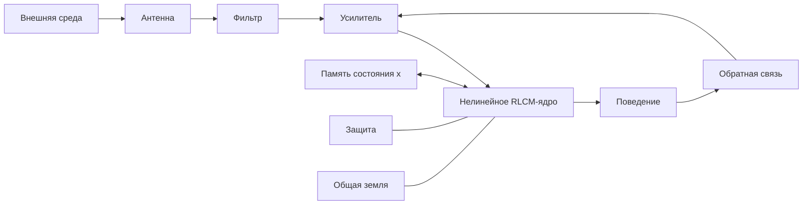

# RLC-FAMILY-3 — Нелинейность, память и гистерезис домашних систем

> **Статус:** сатирическая псевдонаучная модель.  
> Формулы используют реальные идеи нелинейной динамики, теории цепей, гистерезиса и мемристивных систем; семейная интерпретация намеренно абсурдна.

## 0. Зачем линейной модели стало мало

В RLC-FAMILY-1 семья рассматривалась как пассивный RLC-контур.

В RLC-FAMILY-2 к нему были добавлены:

- внешняя антенна;
- фильтр;
- усилитель;
- шум;
- обратная связь;
- общая земля;
- защита.

Но обе модели сохраняли скрытое предположение:

> одинаковое воздействие в одинаковый момент должно вызывать одинаковый ответ.

Практические наблюдения это предположение не подтверждают.

Одна и та же фраза

> «Пора делать уроки»

может вызвать:

- немедленное выполнение;
- молчание;
- торг;
- исчезновение;
- встречный вопрос;
- философский спор о природе образования.

Следовательно, семейная система должна быть расширена как минимум двумя механизмами:

1. **NONLIN1** — нелинейность;
2. **MEM1** — память состояния.

Общий закон третьей части:

$$
I(t)=F\big(U(t),x(t)\big),
$$

где $x(t)$ — внутреннее состояние, зависящее от предыстории.

Именно поэтому одного текущего напряжения недостаточно, чтобы предсказать текущий ток.

---

# Часть I. NONLIN1 — подросток как нелинейный элемент

## 1. Линейный ребёнок как предельный случай

В базовой модели ребёнок был сопротивлением:

$$
U=IR.
$$

То есть

$$
I=\frac{U}{R}.
$$

Это линейная зависимость:

$$
\frac{dI}{dU}=\frac1R=\text{const}.
$$

Такое приближение допустимо только на ранних стадиях эксплуатации.

С возрастом характеристика усложняется.

---

## 2. Определение NONLIN1

**Подросток** — нелинейный двухполюсник, для которого связь между приложенным напряжением $U$ и полезным током $I$ не может быть описана постоянным сопротивлением.

В общем виде:

$$
I=f(U).
$$

При этом:

$$
\frac{dI}{dU}\neq \text{const}.
$$

В отдельных диапазонах допускается даже

$$
\frac{dI}{dU}<0.
$$

То есть увеличение приложенного напряжения способно уменьшать полезный ток.

Бытовая формулировка:

> чем сильнее давишь, тем меньше происходит то, ради чего давил.

---

## 3. Порог включения

Пусть существует порог $U_{\text{th}}$.

Тогда в первом приближении:

$$
I(U)=
\begin{cases}
0, & |U|<U_{\text{th}},\\
g(U), & |U|\ge U_{\text{th}}.
\end{cases}
$$

До порога система находится в зоне нечувствительности.

Типичный эксперимент:

> — Убери кружку.  
> — ...  
> — Убери кружку.  
> — ...  
> — Я кому говорю?  
> — Да услышал я.

Сигнал был принят уже на первом импульсе, но выходной ток не наблюдался.

### Гипотеза NONLIN1-A

**Отсутствие видимого отклика не доказывает отсутствия внутреннего сигнала.**

---

## 4. Зона нечувствительности

Введём dead zone шириной $2U_d$:

$$
I(U)=0,\qquad |U|<U_d.
$$

В этой области любые малые управляющие воздействия поглощаются внутренней динамикой элемента.

Это объясняет, почему:

- одна просьба не работает;
- две просьбы статистически похожи на одну;
- третья внезапно классифицируется как «ты постоянно орёшь».

---

## 5. Насыщение

Даже при дальнейшем росте напряжения полезный ток не обязан расти неограниченно.

Пусть:

$$
\lim_{U\to\infty} I(U)=I_{\max}.
$$

Это режим насыщения.

После достижения $I_{\max}$ дополнительное напряжение преобразуется преимущественно в:

- нагрев;
- шум;
- встречное напряжение;
- закрывание двери.

### Следствие NONLIN1-B

После насыщения усиление входа перестаёт увеличивать полезный выход.

То есть команда

> «Быстрее!»

при уже достигнутом $I_{\max}$ увеличивает главным образом тепловыделение.

---

## 6. Отрицательное дифференциальное сопротивление

Определим дифференциальное сопротивление:

$$
r_d=\frac{dU}{dI}.
$$

Если

$$
\frac{dI}{dU}<0,
$$

то

$$
r_d<0.
$$

В этом режиме увеличение управляющего напряжения приводит к уменьшению полезного тока.

### Гипотеза NONLIN1-C

У подростковой подсистемы существует диапазон, в котором команда становится контрпродуктивной.

Например:

$$
U_1<U_2,
$$

но

$$
I(U_1)>I(U_2).
$$

Бытовой перевод:

> «Я бы сделал, пока ты не начал заставлять».

---

## 7. Кусочно-нелинейная модель подростка

Минимальная модель:

$$
I(U)=
\begin{cases}
0, & 0\le U<U_1,\\
k_1(U-U_1), & U_1\le U<U_2,\\
I_p-k_2(U-U_2), & U_2\le U<U_3,\\
I_s, & U\ge U_3.
\end{cases}
$$

где:

- $U_1$ — порог замечания;
- $U_2$ — начало нормальной реакции;
- $U_3$ — переход в режим принципиального сопротивления;
- $I_p$ — максимальный полезный ток;
- $I_s$ — остаточный ток после насыщения.

Схематически:

```text
I
│          /\
│         /  \
│        /    \____
│_______/
└────────────────── U
        ↑    ↑
       U1   U2
```

Главное свойство характеристики:

> большее входное воздействие не гарантирует большего полезного выхода.

---

## 8. Локальная линеаризация

Несмотря на нелинейность, около рабочей точки $(U_0,I_0)$ систему можно линеаризовать:

$$
\Delta I\approx
\left.
\frac{dI}{dU}
\right|_{U_0}
\Delta U.
$$

Это объясняет, почему родителям иногда кажется, что они наконец «поняли, как это работает».

Они просто нашли локальный участок характеристики.

После изменения рабочей точки модель снова перестаёт работать.

---

## 9. Теорема о бессмысленности постоянного усиления

Пусть система имеет нелинейную характеристику с областью

$$
\frac{dI}{dU}<0.
$$

Тогда существует диапазон, в котором увеличение $U$ уменьшает $I$.

Следовательно, стратегия

$$
U_{n+1}>U_n
$$

не гарантирует

$$
I_{n+1}>I_n.
$$

Что и требовалось доказать.

Бытовой вариант:

> **повышение голоса не является универсальным регулятором.**

---

# Часть II. MEM1 — семейная память как гистерезис

## 10. Почему функции $I=f(U)$ уже недостаточно

Даже нелинейная функция $I=f(U)$ предполагает:

> одному и тому же $U$ соответствует один и тот же $I$.

Но рассмотрим два состояния:

### Сценарий A

> — Купим новый диван?

### Сценарий B

За неделю до этого уже были:

- новая кухня;
- новый телевизор;
- отпуск;
- спор о бюджете.

После чего:

> — Купим новый диван?

Входное напряжение формально одинаково.

Ответ — нет.

Следовательно:

$$
I\neq f(U)
$$

в строгом смысле.

Нужно:

$$
I=f(U,x),
$$

где $x$ содержит память системы.

---

## 11. Определение MEM1

**Семейная память** — внутреннее состояние, при котором выход зависит не только от текущего входа, но и от траектории, по которой система пришла в текущую точку.

Формально:

$$
I(t)=F(U(t),x(t)),
$$

$$
\dot x=G(U,I,x).
$$

Это уже система с памятью.

---

## 12. Гистерезис

Пусть вход $U$ сначала увеличивается, а затем уменьшается.

Если при одном и том же значении $U^\*$ выполняется:

$$
I_{\uparrow}(U^\*)\neq I_{\downarrow}(U^\*),
$$

то система демонстрирует гистерезис.

Схематически:

```text
I
│       ╭──────╮
│     ╭─╯      ╰─╮
│    ╱            ╲
│    ╲            ╱
│     ╰─╮      ╭─╯
│       ╰──────╯
└────────────────── U
```

Одинаковый текущий вход.

Разный выход.

Причина — разная история движения.

---

## 13. Остаточное состояние

В магнитном гистерезисе после снятия внешнего поля может сохраняться остаточная намагниченность.

В семейной модели:

$$
U\rightarrow0
$$

не обязано означать

$$
x\rightarrow0.
$$

### Определение MEM1-R

**Остаточная семейная память** — ненулевое внутреннее состояние после исчезновения исходного воздействия.

Бытовая формулировка:

> разговор закончился, а состояние — нет.

---

## 14. Коэрцитивный порог

Для возврата системы к нулевому состоянию может потребоваться воздействие противоположного знака.

Пусть $U_c$ — минимальное компенсирующее воздействие.

Тогда:

$$
|U|<U_c
$$

недостаточно для сброса состояния.

А при

$$
|U|\ge U_c
$$

становится возможен переход в другую ветвь петли.

Семейные аналоги $U_c$:

- извинение;
- исправление действия;
- возврат денег;
- выполнение обещания;
- признание факта;
- время плюс отсутствие повторного возбуждения.

### Теорема MEM1-C

Фраза

> «Ну я же уже сказал, что всё нормально»

не гарантирует $x=0$.

---

## 15. Реманентность обиды

Введём переменную внутреннего состояния $m$:

$$
m(t)\in[-1,1].
$$

Пусть после сильного воздействия:

$$
m(t_0)=m_r\neq0.
$$

Даже если затем

$$
U(t>t_0)=0,
$$

может сохраняться:

$$
m(t)>0.
$$

Назовём $m_r$ **остаточной обидой**.

Это не дополнительный внешний сигнал.

Это сохранённое состояние материала.

---

## 16. Мемристивное расширение семьи

Ещё точнее память можно описать через мемристивную систему:

$$
U=R(x)\,I,
$$

$$
\dot x=F(x,I).
$$

Теперь эффективное сопротивление зависит от внутреннего состояния:

$$
R=R(x).
$$

То есть:

> сопротивление зависит от того, что через систему уже протекало.

Это значительно ближе к наблюдаемой семейной физике.

### Гипотеза MEM2

Семья обладает не только $R$, $L$ и $C$, но и эффективной **мемристивностью**.

Следовательно, более полный минимальный набор:

$$
RLCM.
$$

где $M$ — память предыдущего тока.

---

## 17. Фраза «а вот в прошлый раз»

В линейной безынерционной модели прошлый вход не входит в текущее уравнение.

В мемристивной модели входит через $x(t)$.

Поэтому выражение:

> «А вот в прошлый раз ты...»

не является внешней аномалией.

Это прямое считывание внутреннего состояния системы.

---

## 18. Малые петли гистерезиса

Не каждое возмущение проходит полную петлю.

Если амплитуда мала, система образует minor loop — внутреннюю петлю меньшего масштаба.

В семейной интерпретации:

- спор начался;
- почти дошёл до старой темы;
- стороны остановились;
- система вернулась, не проходя полный исторический цикл.

### Гипотеза MEM3

Зрелая система отличается не отсутствием петель гистерезиса, а способностью удерживать их локальными.

То есть:

> хороший спор не обязан поднимать архив с 2014 года.

---

# Часть III. Совместная модель NONLIN + MEM

## 19. Нелинейный элемент с памятью

Объединим обе гипотезы:

$$
I=F(U,x),
$$

$$
\dot x=G(U,I,x).
$$

Теперь текущая реакция зависит:

1. от величины воздействия;
2. от рабочей точки;
3. от внутреннего состояния;
4. от предшествующей траектории.

Это уже не обычный резистор.

Это домашняя система.

---

## 20. Главный эффект

Пусть в моменты $t_1$ и $t_2$:

$$
U(t_1)=U(t_2).
$$

Но если:

$$
x(t_1)\neq x(t_2),
$$

то вообще говоря:

$$
I(t_1)\neq I(t_2).
$$

### Теорема PATH1

**Одинаковое воздействие не обязано давать одинаковую реакцию, если история системы различна.**

Это центральный результат RLC-FAMILY-3.

---

## 21. Почему вчера можно было

Рассмотрим эксперимент:

> — Но вчера ты разрешил.

С точки зрения безынерционной модели это сильный аргумент:

$$
U_{\text{вчера}}=U_{\text{сегодня}}
\Rightarrow
I_{\text{вчера}}=I_{\text{сегодня}}.
$$

Но при наличии памяти:

$$
x_{\text{вчера}}\neq x_{\text{сегодня}}.
$$

Следовательно:

$$
F(U,x_{\text{вчера}})
\neq
F(U,x_{\text{сегодня}}).
$$

### Следствие PATH1.1

Фраза «вчера можно было» не является доказательством динамической эквивалентности состояний.

---

## 22. Сброс состояния

Полный сброс памяти потребовал бы:

$$
x\rightarrow x_0.
$$

Но физически это не всегда достигается простым снятием входа.

Возможны три режима:

### 22.1 Естественное затухание

$$
\dot x=-\lambda x,
$$

откуда

$$
x(t)=x_0e^{-\lambda t}.
$$

В бытовом переводе:

> «дай время».

### 22.2 Активная компенсация

Вводится управляющее воздействие $u_c(t)$, направленное против сохранённого состояния.

Бытовой перевод:

> «исправь то, что сделал».

### 22.3 Повторное возбуждение

Если до завершения релаксации приходит новый импульс того же знака, состояние усиливается.

Бытовой перевод:

> «И вот опять».

---

## 23. Накопление малых импульсов

Пусть каждый импульс мал:

$$
|U_k|<U_{\text{crit}}.
$$

Но память интегрирует воздействие:

$$
x_{n+1}=\alpha x_n+\beta U_n.
$$

При $\alpha$ близком к единице множество слабых импульсов способно создать большое состояние.

### Гипотеза ACC1

Серия малых событий может вызвать переход, хотя ни одно событие по отдельности не превышало критический порог.

Это объясняет загадочный эксперимент:

> — А что я такого сейчас сказал?  
> — Дело не в сейчас.

---

## 24. Бифуркация бытового режима

Если внутреннее состояние $x$ меняет форму характеристики $F$, система может перейти в другой режим.

До критического значения:

$$
x<x_c
$$

существует спокойная ветвь.

После:

$$
x>x_c
$$

старая рабочая точка исчезает или становится неустойчивой.

Это уже бифуркация.

Бытовая формулировка:

> последняя кружка в раковине редко является причиной; она является управляющим параметром, после которого исчезла устойчивая ветвь.

---

## 25. Состояние «последняя капля»

Пусть накопленная переменная:

$$
x_{n+1}=x_n+\Delta x_n.
$$

И критический порог:

$$
x_c.
$$

Если:

$$
x_n<x_c,
$$

система остаётся в прежнем режиме.

Но один малый импульс $\varepsilon$ может дать:

$$
x_n+\varepsilon>x_c.
$$

Сам импульс мал.

Переход велик.

### Теорема DROP1

Размер события, вызвавшего переход, не равен размеру накопленной причины.

Неформально:

> последняя капля отвечает только за то, что была последней.

---

## 26. Связь с RLC-FAMILY-2

Вторая часть определила внешний тракт:

$$
E
\rightarrow
Antenna
\rightarrow
Filter
\rightarrow
Amplifier
\rightarrow
RLC.
$$

Теперь последний блок должен быть заменён на:

$$
RLCM_{\text{nonlinear}}.
$$

Полная архитектура:



Таким образом, внешний сигнал сначала искажается трактом, а затем попадает в нелинейную систему, которая ещё и помнит всё предыдущее.

---

## 27. Новое определение семейной устойчивости

Для линейной системы было достаточно изучать затухание возмущений.

Теперь требуется устойчивость расширенного состояния:

$$
z(t)=
\begin{bmatrix}
i(t)\\
u(t)\\
x(t)
\end{bmatrix}.
$$

Система устойчива, если после допустимого возмущения:

$$
z(t)\rightarrow z^\*.
$$

Однако $z^\*$ не обязан совпадать с прежним состоянием.

### Гипотеза STAB2

После сильного события семья может стабилизироваться, но уже в другой рабочей точке.

То есть:

> **устойчивость не гарантирует возврата к прошлому.**

---

## 28. Канонические результаты RLC-FAMILY-3

### NONLIN1

Подростковая подсистема нелинейна:

$$
I=f(U),
\qquad
\frac{dI}{dU}\neq const.
$$

### NONLIN1-C

Возможна область:

$$
\frac{dI}{dU}<0.
$$

### MEM1

Реакция зависит от внутреннего состояния:

$$
I=F(U,x).
$$

### PATH1

Одинаковый вход не гарантирует одинакового выхода:

$$
U_1=U_2
\not\Rightarrow
I_1=I_2.
$$

### ACC1

Малые воздействия могут накапливаться.

### DROP1

Последнее событие не обязано быть главным по величине.

### STAB2

Система может восстановить устойчивость в новой рабочей точке.

---

## 29. Экспериментальные предсказания

Модель предсказывает следующие наблюдения:

1. Повторение команды с большей амплитудой иногда ухудшает результат.
2. Один и тот же вопрос в разные дни может иметь разные передаточные характеристики.
3. После исчезновения конфликта внутреннее состояние может сохраняться.
4. Малые события могут интегрироваться до критического порога.
5. Последний слабый импульс способен вызвать большой переход.
6. «Вчера работало» не является достаточным основанием ожидать работу сегодня.
7. Полный сброс требует изменения состояния, а не только исчезновения текущего входа.

Все семь эффектов запрещены простейшей линейной безынерционной моделью и естественно возникают в NONLIN+MEM расширении.

---

## 30. Следующий исследовательский фронт

После введения нелинейности и памяти становятся осмысленными следующие этапы:

1. **CTRL1** — полюса, регуляторы и устойчивость расширенной системы.
2. **NET1** — развод как топологическая реконфигурация графа.
3. **PAR1** — паразитная связь между семейными контурами.
4. **SRC1** — внешний источник ЭДС и родственники.
5. **PWR1** — энергетика семьи, бюджет, ипотека и мощность нагрузки.
6. **PET1** — кот как стохастический источник и демпфирующий элемент.
7. **CHAOS1** — возможность детерминированного хаоса при нелинейности, памяти и обратной связи.

---

# Заключение

RLC-FAMILY-3 снимает два нереалистичных ограничения ранней модели:

- линейность;
- отсутствие памяти.

Семейная сеть теперь описывается как нелинейная динамическая система с внутренним состоянием:

$$
I=F(U,x),
$$

$$
\dot x=G(U,I,x).
$$

Из этого следует главный результат третьей части:

> **Чтобы понять текущую реакцию системы, недостаточно знать, что на неё действует сейчас. Нужно знать, как она сюда пришла.**

И главный практический вывод:

> **Если вчера при том же напряжении ток был другим — это не обязательно неисправность. Возможно, вы просто измеряете систему с памятью.**
