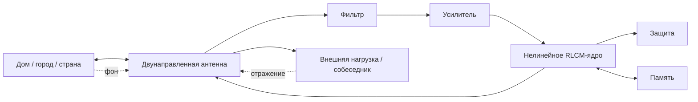

# RLC-FAMILY-4 — Излучение, согласование и внешний энергетический фон

> **Статус:** сатирическая псевдонаучная модель.  
> Физические понятия излучения, согласования, отражения, мощности и спектра используются в реальном техническом смысле; их семейная, бытовая и социальная интерпретация намеренно метафорична.
>
> **Важно:** «радиационный фон» в этой главе **не означает ионизирующую радиацию**. Это внутренний термин RLC-family для суммарного информационно-эмоционального поля, создаваемого множеством взаимодействующих социальных контуров.

## 0. Новая поправка к модели антенны

В RLC-FAMILY-2 антенна была введена главным образом как приёмник внешнего сигнала:

$$
E_{\mathrm{ext}}
\rightarrow
Antenna
\rightarrow
Filter
\rightarrow
Amplifier
\rightarrow
RLCM.
$$

Но антенна принципиально интереснее как **двунаправленный интерфейс**.

В расширенной модели:

$$
\boxed{
RLCM
\leftrightarrow
Antenna
\leftrightarrow
External\ field
}
$$

То есть один и тот же внешний канал может:

1. принимать энергию и информацию;
2. излучать их наружу;
3. отражать часть энергии обратно;
4. связывать семейный контур с другими контурами.

Это вводит новый механизм стабилизации:

> **иногда системе необходимо не поглотить энергию и не рассеять её внутри, а безопасно излучить наружу.**

---

# Часть I. RAD1 — антенна как канал сброса энергии

## 1. Энергетический баланс

Пусть полная накопленная энергия семейного контура равна

$$
E(t)=E_C+E_L+E_M+\ldots
$$

Для идеализированной системы:

$$
\frac{dE}{dt}
=
P_{\mathrm{in}}
-
P_{\mathrm{int}}
-
P_{\mathrm{rad}},
$$

где:

- $P_{\mathrm{in}}$ — входящая мощность;
- $P_{\mathrm{int}}$ — внутренние потери;
- $P_{\mathrm{rad}}$ — мощность, выведенная во внешний канал.

Если

$$
P_{\mathrm{rad}}>0,
$$

энергия покидает внутренний контур.

### Гипотеза RAD1

**Внешнее излучение может выполнять роль дополнительного демпфирования семейной системы.**

Бытовые аналоги:

- поговорить с другом;
- написать текст;
- сходить побегать;
- сыграть музыку;
- поорать на стадионе;
- сходить к психологу;
- рассказать историю;
- написать идиотский стишок.

В каждом случае часть накопленной внутренней энергии переводится во внешний канал вместо продолжения циркуляции внутри RLCM-сети.

---

## 2. Радиционное сопротивление

В антенной технике излучаемую мощность удобно представлять через эквивалентное радиационное сопротивление.

Для действующего значения тока:

$$
P_{\mathrm{rad}}=I_{\mathrm{rms}}^2R_{\mathrm{rad}}.
$$

В RLC-family $R_{\mathrm{rad}}$ означает эффективность безопасного вывода энергии через внешний канал.

Большое полезное $R_{\mathrm{rad}}$ означает:

> система умеет выпускать избыток энергии наружу, не превращая весь этот избыток во внутренний нагрев.

### Следствие RAD1-A

Не всякая потеря энергии является дефектом.

Иногда:

$$
P_{\mathrm{loss}}
=
P_{\mathrm{useful\ dump}}.
$$

Отсюда:

> **стабильная система должна уметь не только хранить энергию, но и грамотно от неё избавляться.**

---

## 3. Внутреннее рассеяние и внешнее излучение

Сравним два режима.

### Режим A — внутреннее рассеяние

$$
P_{\mathrm{excess}}\rightarrow P_R.
$$

Избыточная энергия превращается во внутренний нагрев.

Бытовые проявления:

- раздражение;
- повторный спор;
- бессонная прокрутка разговора;
- пассивная агрессия;
- нагрев кухни без изменения температуры чайника.

### Режим B — внешнее излучение

$$
P_{\mathrm{excess}}\rightarrow P_{\mathrm{rad}}.
$$

Энергия покидает внутренний контур.

### Гипотеза RAD2

При прочих равных увеличение доли безопасного внешнего излучения уменьшает энергию, остающуюся во внутренних модах.

---

# Часть II. MATCH1 — согласование внешнего канала

## 4. Не всякая антенна разгружает систему

Наличие внешнего канала само по себе не гарантирует передачи энергии.

Если нагрузка плохо согласована с источником, возникает отражение.

Для простейшей линии передачи коэффициент отражения:

$$
\Gamma
=
\frac{Z_L-Z_0}{Z_L+Z_0},
$$

где:

- $Z_0$ — характеристический импеданс канала;
- $Z_L$ — импеданс нагрузки.

При идеальном согласовании:

$$
Z_L=Z_0,
$$

поэтому

$$
\Gamma=0.
$$

При сильном рассогласовании:

$$
|\Gamma|\rightarrow1.
$$

---

## 5. Гипотеза согласованного собеседника

### MATCH1

**Эффективность эмоционального сброса зависит не только от существования внешнего канала, но и от его согласования с источником.**

Эксперимент:

> — Я другу всё рассказал.  
> — Полегчало?  
> — Нет. Он сказал: «Сам виноват».

Энергия была направлена во внешний тракт, но существенная её доля вернулась к источнику.

В псевдоэнергетическом приближении:

$$
P_{\mathrm{return}}
=
|\Gamma|^2P_{\mathrm{emit}}.
$$

Тогда эффективный сброс:

$$
P_{\mathrm{dump}}
=
P_{\mathrm{emit}}
-
P_{\mathrm{return}}.
$$

или:

$$
P_{\mathrm{dump}}
=
(1-|\Gamma|^2)P_{\mathrm{emit}}.
$$

### Следствие MATCH1-A

Разговор продолжительностью два часа может иметь:

$$
P_{\mathrm{dump}}\approx0,
$$

если собеседник является почти идеальным отражателем.

---

## 6. Типы нагрузок

Внешние собеседники можно классифицировать по отклику.

### 6.1 Согласованная нагрузка

Принимает сигнал без значительного отражения.

Бытовой аналог:

> «Понял. Рассказывай».

### 6.2 Короткое замыкание

Отвечает мгновенным собственным возбуждением:

> «Да это ещё ничего! Вот у меня...»

Исходный сигнал практически исчезает в новой токовой ветви.

### 6.3 Разомкнутая нагрузка

Практически не принимает ток:

> «Угу».  
> «Угу».  
> «Ясно».

### 6.4 Активная нагрузка

Не просто принимает сигнал, но добавляет энергию:

> «А ты знаешь, что она ещё вчера сказала про тебя?»

Такой канал способен вернуть больше возмущения, чем получил.

---

# Часть III. BCAST1 — излучение может создавать новые проблемы

## 7. Безопасный сброс и широковещание

Нужно различать два режима.

### RAD — локальный сброс

Энергия выводится во внешний согласованный канал и не создаёт существенной обратной связи.

### BCAST — широковещание

Излучение достигает множества других контуров.

Пример:

> пожаловаться одному другу

и

> подробно описать семейный конфликт в социальной сети

не являются эквивалентными антенными режимами.

Во втором случае возникают:

- множество приёмников;
- повторные передачи;
- усилители;
- задержки;
- отражения;
- новые источники.

---

## 8. Закон возвратного излучения

Пусть исходная система излучает сигнал $s_0(t)$.

Другие контуры принимают его и создают ответы:

$$
s_k(t)=H_k[s_0(t)].
$$

Часть этих сигналов возвращается:

$$
s_{\mathrm{return}}(t)
=
\sum_k G_k s_k(t-\tau_k).
$$

### Гипотеза BCAST1

**Слишком мощный внешний сброс способен уменьшить внутреннюю энергию в первый момент и одновременно создать отложенное повторное возбуждение.**

Бытовая формулировка:

> выговорился всем — стало легче;  
> утром начали звонить все.

---

## 9. Антенна как передатчик и приёмник

В линейной взаимной антенной системе передающие и приёмные свойства тесно связаны.

В псевдомодели это приводит к полезному наблюдению:

> тот, кто хорошо вещает наружу, часто обладает и хорошим каналом приёма обратно.

Поэтому усиление антенны без фильтра не всегда стабилизирует систему.

Можно увеличить:

$$
G_{\mathrm{TX}},
$$

но одновременно получить большое:

$$
G_{\mathrm{RX}}.
$$

В результате система великолепно сбрасывает энергию в окружающих и столь же великолепно принимает их реакцию обратно.

---

# Часть IV. FIELD1 — внешний фон множества контуров

## 10. От одной семьи к дому

До сих пор рассматривалась одна семейная сеть.

Пусть в доме существуют $N$ контуров:

$$
\mathcal F_1,\mathcal F_2,\ldots,\mathcal F_N.
$$

Каждый способен:

- принимать;
- излучать;
- отражать;
- фильтровать;
- усиливать.

Тогда локальное внешнее поле для контура $i$ создаётся уже не одним источником:

$$
E_i(t)
=
E_{\mathrm{global}}(t)
+
\sum_{j\ne i}K_{ji}s_j(t-\tau_{ji})
+
n_i(t).
$$

Это первая сетевая версия RLC-family.

---

## 11. Псевдорадиационный фон дома

### Определение FIELD1

**Фон дома** — суммарное информационно-эмоциональное возбуждение, создаваемое всеми активными контурами здания и внешними источниками.

Его можно описывать через условную спектральную плотность:

$$
S_{\mathrm{house}}(\omega)
=
\sum_{k=1}^{N}S_k(\omega)
+
S_{\mathrm{external}}(\omega).
$$

Это не физическая электромагнитная мощность и не ионизирующая радиация.

Это псевдополе модели: сколько внешнего возбуждения доступно для приёма семейными антеннами на разных «частотах» тем.

Примеры выраженных спектральных линий дома:

- ремонт у соседей;
- парковка;
- шум;
- собрание жильцов;
- протечка;
- «кто опять оставил дверь открытой?».

---

## 12. Городское поле

Для города число контуров становится огромным:

$$
N\gg1.
$$

Вместо отдельных сигналов удобнее рассматривать статистическое поле:

$$
E_{\mathrm{city}}(\mathbf r,t),
$$

где $\mathbf r$ — положение в городской сети.

Можно ввести:

- среднюю мощность фона;
- спектр;
- корреляционную длину;
- время корреляции;
- локальные горячие зоны;
- направленные источники.

### Гипотеза CITY1

В большом городе значительная часть входного возбуждения конкретной семьи может быть произведена не её собственными участниками, а коллективным полем среды.

Примеры:

- транспортный стресс;
- стоимость жилья;
- локальные новости;
- очереди;
- рабочий ритм;
- массовые события;
- соседские группы;
- городские социальные сети.

---

## 13. Фон страны

На ещё большем масштабе введём:

$$
E_{\mathrm{country}}(t,\omega,\mathbf r).
$$

Такой фон формируется множеством источников:

- медиа;
- институтов;
- экономики;
- массовой культуры;
- общих событий;
- сетевых платформ;
- миллионов локальных передатчиков.

При этом отдельная семья оказывается малой подсистемой, погружённой в большое нестационарное поле.

### Гипотеза SCALE1

**Состояние локального семейного контура нельзя полностью объяснить только его внутренними параметрами, если мощность внешнего поля сравнима с внутренними сигналами.**

То есть:

$$
P_{\mathrm{external}}
\sim
P_{\mathrm{internal}}
$$

делает изолированную RLC-модель недостаточной.

---

# Часть V. COH1 — когерентное и некогерентное социальное излучение

## 14. Случайный фон

Если множество источников независимы и имеют случайные фазы, их вклад в значительной мере образует шумоподобный фон.

Условно:

$$
E_{\mathrm{noise}}(t)
=
\sum_k A_k\cos(\omega_k t+\phi_k),
$$

где $\phi_k$ слабо согласованы.

Такое поле воспринимается как общий информационный шум.

---

## 15. Синхронизация источников

Если множество передатчиков начинают повторять близкий сигнал с согласованной структурой, возникает иной режим.

В псевдомодели:

$$
s_1(t)\approx s_2(t)\approx \ldots \approx s_N(t).
$$

Суммарный сигнал становится гораздо заметнее для приёмника.

### Гипотеза COH1

Коллективно синхронизированное сообщение способно сильнее возбуждать локальные контуры, чем такое же число несогласованных сообщений.

Бытовая формулировка:

> одно мнение можно проигнорировать;  
> когда то же самое одновременно говорят родственники, коллеги, лента и телевизор, это уже поле.

Это не утверждение о физической когерентности электромагнитных волн — только системная аналогия.

---

# Часть VI. SHIELD1 — экранирование и санитарная зона

## 16. Не всякий внешний сигнал нужно принимать

Если антенна двунаправленна, возникает задача управления связью со средой.

Система может регулировать:

- усиление антенны;
- полосу фильтра;
- время подключения;
- направление приёма;
- мощность передачи.

### Гипотеза SHIELD1

Устойчивой системе необходим не максимальный обмен с внешней средой, а **управляемый обмен**.

Практические аналоги:

- выключить уведомления;
- не читать комментарии;
- не обсуждать тему с конкретным человеком;
- оставить телефон дома;
- выйти погулять без внешнего потока;
- не публиковать конфликт в реальном времени.

---

## 17. Информационная санитарная зона

Определим условный интервал:

$$
t\in[t_0,t_1],
$$

в котором:

$$
G_{\mathrm{RX}}\downarrow,
\qquad
G_{\mathrm{TX}}\downarrow.
$$

То есть система временно уменьшает и приём, и передачу.

Это режим радиомолчания.

### Следствие SHIELD1-A

Иногда лучший способ стабилизировать антенную систему — некоторое время вообще ничего не передавать и не принимать.

---

# Часть VII. DUMP1 — критерий хорошего сброса

## 18. Сброс не должен разрушать соседний контур

Если энергия выведена из семьи, но полностью внесена в другую систему, глобальная энергия сети не уменьшилась.

Пусть:

$$
P_{\mathrm{dump}}^{(A)}
$$

покидает систему $A$.

Если система $B$ получает:

$$
P_{\mathrm{received}}^{(B)}
\approx
P_{\mathrm{dump}}^{(A)},
$$

и не способна его рассеять, проблема просто перемещена.

### Гипотеза DUMP1

**Хороший внешний сброс уменьшает возбуждение источника, не создавая сопоставимого нежелательного возбуждения в приёмнике.**

Отсюда различие:

- поговорить с согласованным человеком — потенциально демпфирование;
- накричать на случайного человека — перенос энергии;
- написать стишок — преобразование энергии в культурное излучение;
- устроить публичный скандал — широкополосное возбуждение сети.

---

# Часть VIII. Расширенная архитектура RLC-family

## 19. Полная схема версии 4

Теперь система имеет два принципиально разных пути удаления энергии:

$$
RLCM
\rightarrow
R_{\mathrm{internal}}
$$

и

$$
RLCM
\rightarrow
R_{\mathrm{rad}}
\rightarrow
External.
$$

Первый нагревает систему.

Второй способен её разгрузить.

---

## 20. Канонические гипотезы RLC-FAMILY-4

### RAD1

Антенна является не только приёмником, но и каналом внешнего энергетического сброса.

### RAD2

Безопасное излучение увеличивает эффективное демпфирование внутреннего контура.

### MATCH1

Сброс эффективен только при достаточном согласовании внешнего канала.

### BCAST1

Широковещательный сброс способен создавать отложенную обратную связь.

### FIELD1

Множество контуров создаёт общий внешний фон.

### SCALE1

При сильном внешнем поле локальная семья не может рассматриваться как изолированная система.

### COH1

Синхронизированные внешние источники способны создавать более выраженное коллективное возбуждение.

### SHIELD1

Управляемое уменьшение связи со средой может быть стабилизирующим.

### DUMP1

Полезный сброс должен уменьшать энергию источника, не переносив проблему целиком в соседний контур.

---

## 21. Новый энергетический баланс

Для семейной системы, погружённой во внешнее поле:

$$
\frac{dE}{dt}
=
P_{\mathrm{source}}
+
P_{\mathrm{received}}
+
P_{\mathrm{return}}
-
P_{\mathrm{internal}}
-
P_{\mathrm{rad}}
-
P_{\mathrm{useful}}.
$$

Устойчивый режим требует, чтобы усреднённый приток энергии не превосходил способность системы её использовать, рассеивать и излучать:

$$
\left\langle
P_{\mathrm{source}}
+
P_{\mathrm{received}}
+
P_{\mathrm{return}}
\right\rangle
\le
\left\langle
P_{\mathrm{internal}}
+
P_{\mathrm{rad}}
+
P_{\mathrm{useful}}
\right\rangle.
$$

Если неравенство систематически нарушается, энергия внутренних состояний растёт.

А дальше вступает RLC-FAMILY-3:

- нелинейность;
- память;
- накопление;
- порог;
- последняя капля;
- переход в новый режим.

---

## 22. Главный результат версии 4

Ранее антенна считалась потенциальной проблемой: через неё в систему приходит внешний сигнал.

Теперь видно, что выключить антенну навсегда тоже нельзя.

Она может быть необходимым стабилизирующим каналом.

Поэтому задача состоит не в отсутствии антенны, а в трёх свойствах:

$$
\boxed{
\text{фильтрация}
+
\text{согласование}
+
\text{управляемая двунаправленность}
}
$$

Главный вывод:

> **Иногда антенна нужна не для того, чтобы услышать мир, а для того, чтобы перестать гудеть самому.**

---

## 23. Следующий исследовательский фронт

Версия 4 открывает новый масштаб теории:

1. **HOUSE1** — дом как сеть нескольких RLCM-контуров.
2. **CITY2** — пространственная карта городского поля и локальные горячие зоны.
3. **COUNTRY1** — многоуровневая модель национального информационного фона.
4. **NET1** — граф взаимодействий между семьями.
5. **SPECTRUM1** — спектральные линии типовых социальных возбуждений.
6. **SYNC1** — синхронизация большого числа контуров.
7. **CASCADE1** — каскадное распространение возбуждения по сети.
8. **CTRL1** — активное управление связью, фильтрацией и демпфированием.
9. **CHAOS1** — нелинейные режимы большой связанной сети.

---

# Заключение

RLC-FAMILY-4 превращает антенну из одностороннего сенсора в полноценный энергетический интерфейс.

Семейный контур теперь способен:

- принимать внешнее возбуждение;
- фильтровать его;
- отражать;
- излучать собственную энергию;
- согласовываться с внешней нагрузкой;
- создавать широковещательные возмущения;
- существовать внутри суммарного поля дома, города и страны.

Главное дополнение к предыдущей теории:

> **Не всякая энергия должна быть переработана внутри системы. Иногда устойчивость требует хорошего канала наружу.**

А переход к дому, городу и стране задаёт следующую ступень:

$$
\boxed{
\text{одиночный RLCM-контур}
\rightarrow
\text{сеть контуров}
\rightarrow
\text{коллективное поле}
}
$$
