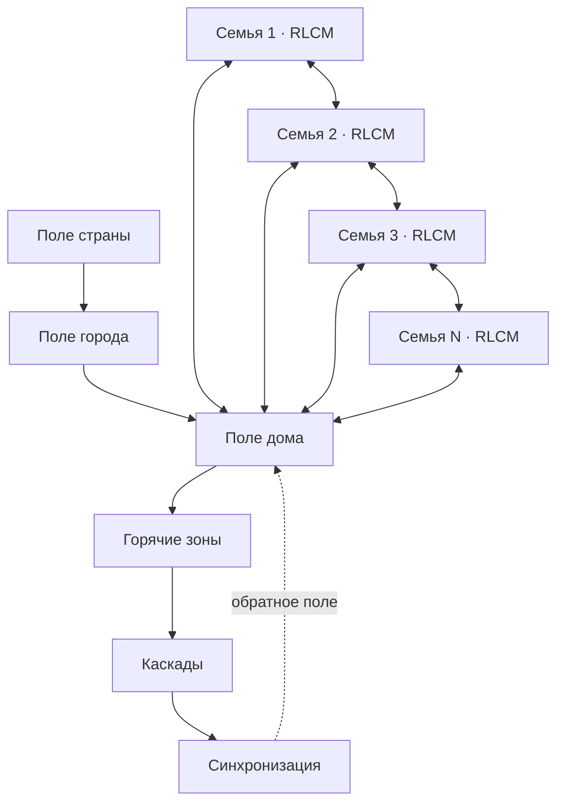

# RLC-FAMILY-5 — Коллективное поле, синхронизация и каскады социальных контуров

> **Статус:** сатирическая псевдонаучная модель.  
> Используются реальные математические идеи графов, связанных осцилляторов, спектрального анализа, распространения возмущений и стохастических полей.  
> Все «социально-радиационные» величины ниже являются внутренними метафорическими переменными модели и **не имеют отношения к ионизирующей радиации или реальному электромагнитному облучению людей**.

## 0. Переход от одной семьи к коллективной среде

До RLC-FAMILY-4 основным объектом был отдельный семейный контур:

$$
\mathcal F_i = RLCM_i.
$$

Версия 4 добавила двунаправленную антенну:

$$
\mathcal F_i
\leftrightarrow
A_i
\leftrightarrow
E_{\mathrm{ext}}.
$$

Но в реальной бытовой среде внешнее поле создаётся не абстрактным источником, а множеством других контуров.

Поэтому вводится сеть:

$$
\mathcal G=(V,E),
$$

где каждая вершина

$$
v_i\in V
$$

— отдельный семейный или индивидуальный контур, а ребро

$$
e_{ij}\in E
$$

— канал связи между ними.

Теперь:

$$
\boxed{
\text{семья}
\rightarrow
\text{дом}
\rightarrow
\text{район}
\rightarrow
\text{город}
\rightarrow
\text{страна}
}
$$

становится не перечислением масштабов, а иерархией связанных сетей.

---

# Часть I. HOUSE1 — дом как сеть контуров

## 1. Локальная сеть дома

Пусть в доме находятся $N$ семейных контуров:

$$
\mathcal F_1,\mathcal F_2,\ldots,\mathcal F_N.
$$

Каждый контур имеет собственное состояние:

$$
x_i(t),
$$

собственную антенну:

$$
A_i,
$$

и собственную передаточную функцию:

$$
H_i(\omega).
$$

Внешний сигнал для семьи $i$:

$$
u_i(t)
=
u_i^{\mathrm{ext}}(t)
+
\sum_{j\ne i}K_{ij}s_j(t-\tau_{ij})
+
n_i(t).
$$

Здесь:

- $K_{ij}$ — коэффициент связи;
- $\tau_{ij}$ — задержка;
- $s_j$ — излучение соседнего контура;
- $n_i$ — локальный шум.

### HOUSE1

**Дом является не набором независимых квартир, а слабосвязанной сетью осциллирующих контуров.**

---

## 2. Каналы связи внутри дома

Коэффициент $K_{ij}$ может реализовываться через:

- стены;
- лестничную площадку;
- общий чат;
- парковку;
- детей;
- собак;
- лифт;
- председателя дома;
- ошибочно доставленную посылку.

Особый канал:

> «Вы тоже это слышите?»

имеет почти идеальную способность создавать новую ветвь сети.

---

## 3. Матрица связности дома

Все связи можно собрать в матрицу:

$$
K=
\begin{bmatrix}
0 & K_{12} & \cdots & K_{1N}\\
K_{21} & 0 & \cdots & K_{2N}\\
\vdots & \vdots & \ddots & \vdots\\
K_{N1} & K_{N2} & \cdots & 0
\end{bmatrix}.
$$

Если $K_{ij}=0$, семьи практически не связаны.

Если $|K_{ij}|$ велико, локальное возбуждение легко передаётся между ними.

### Следствие HOUSE1-A

Шум в одной квартире является локальным только до тех пор, пока:

$$
K_{ij}\approx0.
$$

---

# Часть II. SPECTRUM1 — спектр коллективного фона

## 4. Почему одного уровня фона мало

Скалярная величина «фон высокий» недостаточна.

Два дома могут иметь одинаковую суммарную интенсивность, но совершенно разный спектр.

Пусть:

$$
S(\omega)
$$

— условная спектральная плотность коллективного возбуждения.

Тогда:

$$
P_{\mathrm{bg}}
=
\int_0^\infty S(\omega)\,d\omega.
$$

Одинаковое $P_{\mathrm{bg}}$ не означает одинакового воздействия.

---

## 5. Типовые спектральные линии

В доме могут наблюдаться узкие или широкие полосы.

### Низкие частоты

Медленные процессы:

- ипотека;
- ремонт;
- хронический недосып;
- парковочный вопрос;
- «когда уже починят крышу?».

### Средние частоты

Повторяющиеся бытовые процессы:

- школьное расписание;
- мусор;
- доставка;
- соседи;
- еженедельные собрания.

### Высокие частоты

Короткие импульсы:

- хлопок двери;
- сообщение в чате;
- внезапный звонок;
- «срочно зайдите вниз»;
- «чья машина перекрыла выезд?».

### SPECTRUM1

**Для устойчивости системы важна не только мощность фона, но и совпадение его спектра с собственными частотами контуров.**

---

## 6. Спектральное совпадение

Для семьи $i$ введём функцию чувствительности:

$$
\chi_i(\omega).
$$

Тогда эффективное внешнее возбуждение:

$$
P_i^{\mathrm{eff}}
=
\int_0^\infty
\chi_i(\omega)
S(\omega)
\,d\omega.
$$

Отсюда следует:

> один и тот же дом может быть «тихим» для одной семьи и «невыносимым» для другой.

Не потому, что фон разный.

Потому что различаются $\chi_i(\omega)$.

---

# Часть III. CITY2 — город как пространственное поле

## 7. Пространственная зависимость

Для города введём поле:

$$
E(\mathbf r,t).
$$

Теперь уровень возбуждения зависит и от времени, и от положения.

Можно определить локальную мощность:

$$
P(\mathbf r,t)=|E(\mathbf r,t)|^2
$$

в условных единицах модели.

### CITY2

**Городской фон неоднороден в пространстве и времени.**

То есть существуют:

- тихие области;
- горячие зоны;
- узкие источники;
- транспортные полосы;
- зоны накопленного шума;
- места периодической синхронизации.

---

## 8. Городские источники

Вклад в $E(\mathbf r,t)$ могут давать:

$$
E=
E_{\mathrm{traffic}}
+
E_{\mathrm{work}}
+
E_{\mathrm{media}}
+
E_{\mathrm{housing}}
+
E_{\mathrm{events}}
+
E_{\mathrm{social}}
+
n.
$$

Псевдонаучная ценность этой записи в том, что:

> «город достал»

перестаёт быть скалярным утверждением.

Нужно ещё спросить:

> какой именно член суммы?

---

## 9. Корреляционная длина

Пусть:

$$
C(r)
=
\langle
E(\mathbf x,t)
E(\mathbf x+\mathbf r,t)
\rangle.
$$

Если корреляция быстро падает с расстоянием, фон локален.

Если сохраняется на больших расстояниях, одно и то же возбуждение действует на значительную часть города.

Введём условную корреляционную длину:

$$
\xi.
$$

### Следствие CITY2-A

Если

$$
\xi\ll L_{\mathrm{city}},
$$

город распадается на почти независимые зоны.

Если

$$
\xi\sim L_{\mathrm{city}},
$$

возбуждение становится общегородским.

---

# Часть IV. COUNTRY1 — многоуровневое поле страны

## 10. Иерархия масштабов

Пусть семейное состояние зависит от полей нескольких уровней:

$$
E_i(t)
=
E_{\mathrm{family},i}
+
E_{\mathrm{house}}
+
E_{\mathrm{city}}
+
E_{\mathrm{country}}
+
n_i.
$$

Эти уровни не обязаны складываться одинаково.

Введём веса:

$$
E_i^{\mathrm{eff}}
=
a_iE_{\mathrm{house}}
+
b_iE_{\mathrm{city}}
+
c_iE_{\mathrm{country}}.
$$

У разных семей:

$$
(a_i,b_i,c_i)
$$

различны.

### COUNTRY1

**Национальный фон не действует на все локальные контуры одинаково; его влияние определяется локальной связностью, фильтрацией и чувствительностью.**

---

## 11. Общенациональные низкочастотные процессы

К низкочастотному фону относятся процессы с длительным временем корреляции:

- стоимость жизни;
- рынок жилья;
- трудовой режим;
- крупные институциональные изменения;
- длительные культурные тренды;
- затяжные общественные темы.

Они отличаются от короткого информационного импульса тем, что:

$$
\tau_{\mathrm{corr}}\gg T_{\mathrm{family}}.
$$

То есть семейный контур вынужден жить внутри поля, которое меняется медленнее его собственной внутренней динамики.

---

## 12. Быстрый национальный импульс

Пусть крупное событие создаёт:

$$
E_{\mathrm{country}}(t)
=
A\delta(t-t_0)
$$

в идеализированном пределе.

Тогда множество локальных систем получает почти одновременное возбуждение.

Дальнейшая реакция определяется уже их собственными:

- фильтрами;
- памятью;
- нелинейностью;
- резонансными частотами;
- сетевыми связями.

То есть одинаковый внешний импульс не создаёт одинаковый локальный ответ.

---

# Часть V. SYNC1 — синхронизация связанных контуров

## 13. Фазовая модель

Пусть каждый контур имеет собственную фазу:

$$
\theta_i(t)
$$

и собственную частоту:

$$
\omega_i.
$$

Для слабосвязанных осцилляторов используем модель типа Курамото:

$$
\dot\theta_i
=
\omega_i
+
\frac{K}{N}
\sum_{j=1}^{N}
\sin(\theta_j-\theta_i).
$$

Это не модель людей как физических осцилляторов.

Это математическая метафора согласования ритмов.

### SYNC1

При достаточно сильной связи набор разнородных контуров способен частично синхронизироваться.

---

## 14. Параметр порядка

Введём:

$$
re^{i\psi}
=
\frac1N
\sum_{j=1}^{N}
e^{i\theta_j}.
$$

Тогда:

$$
0\le r\le1.
$$

Если:

$$
r\approx0,
$$

фазы распределены беспорядочно.

Если:

$$
r\approx1,
$$

система высоко синхронизирована.

Бытовой перевод:

- $r\approx0$: каждый злится по своему поводу;
- $r\approx1$: весь дом злится из-за одной и той же парковки.

---

## 15. Порог коллективной синхронизации

Пусть существует критическое значение связи:

$$
K_c.
$$

При:

$$
K<K_c
$$

глобальной синхронизации нет.

При:

$$
K>K_c
$$

часть системы может войти в общий режим.

### Следствие SYNC1-A

Увеличение связности не всегда успокаивает сеть.

Иногда оно просто помогает всем одновременно возбудиться по одной теме.

---

# Часть VI. CASCADE1 — каскадное распространение

## 16. Локальный импульс

Пусть одна вершина сети получает возбуждение:

$$
x_i>x_c.
$$

Она передаёт сигнал соседям.

Если у соседа $j$ выполняется:

$$
K_{ij}x_i + h_j > \Theta_j,
$$

то и он переходит в возбуждённое состояние.

После этого он сам становится источником.

---

## 17. Каскад

Определим множество активных вершин на шаге $n$:

$$
A_n.
$$

Тогда:

$$
A_{n+1}
=
A_n
\cup
\left\{
j:
\sum_{i\in A_n}K_{ij}>\Theta_j
\right\}.
$$

### CASCADE1

**Малое локальное событие способно вызвать большой сетевой эффект, если топология и пороги сети допускают самоподдерживающийся каскад.**

Это сетевой аналог «последней капли» из RLC-FAMILY-3.

Но теперь последняя капля может быть не у одного элемента, а у целого графа.

---

## 18. Бытовой пример каскада

Начальный сигнал:

> «Кто оставил мусор рядом с контейнером?»

Стадии:

1. один сосед пишет в чат;
2. второй добавляет фотографию;
3. третий вспоминает парковку;
4. четвёртый подключает тему управляющей компании;
5. пятый пишет «я давно говорил»;
6. появляется опрос;
7. создаётся отдельная группа;
8. исходный пакет мусора перестаёт быть существенной переменной.

Это и есть каскадный переход сети в новое состояние.

---

# Часть VII. BACKGROUND1 — коллективный «радиационный» фон

## 19. Определение фона

Введём условный коллективный фон:

$$
B(\mathbf r,t,\omega).
$$

Он характеризует количество доступного внешнего возбуждения в:

- пространстве;
- времени;
- частотной полосе.

Это **не физическая радиация**.

Это агрегированная переменная псевдотеории.

Для разных масштабов:

$$
B_{\mathrm{house}},
\qquad
B_{\mathrm{city}},
\qquad
B_{\mathrm{country}}.
$$

---

## 20. Суммарный фон

В простейшем линейном приближении:

$$
B_{\mathrm{tot}}
=
B_{\mathrm{house}}
+
B_{\mathrm{city}}
+
B_{\mathrm{country}}.
$$

Но после введения нелинейности и синхронизации:

$$
B_{\mathrm{tot}}
\neq
\sum_k B_k
$$

в общем случае.

Появляются:

- усиление;
- подавление;
- резонанс;
- корреляция;
- синхронизация;
- каскады.

### BACKGROUND1

**Коллективный фон является свойством не только источников, но и структуры их связи.**

---

# Часть VIII. HOTSPOT1 — горячие зоны

## 21. Локальное усиление поля

Даже при умеренном среднем фоне возможны точки:

$$
B(\mathbf r^\*)\gg \langle B\rangle.
$$

Назовём их горячими зонами.

Причины:

- высокая плотность связей;
- сильный локальный усилитель;
- резонанс;
- источник с большой мощностью;
- плохое демпфирование;
- многократная ретрансляция.

Бытовые примеры:

- родительский чат;
- домовой чат;
- офисная кухня;
- комментарии под локальной новостью;
- собрание жильцов.

---

## 22. Центральность передатчика

Для графа можно определить степень вершины:

$$
k_i=\sum_j A_{ij}.
$$

Чем выше $k_i$, тем больше прямых связей имеет источник.

Но простой степени недостаточно.

Нужно учитывать:

- вес связей;
- направление;
- доверие;
- усиление;
- повторную передачу.

Поэтому условная «мощность распространителя»:

$$
P_i^{\mathrm{network}}
=
G_i
\sum_j w_{ij}T_{ij},
$$

где:

- $G_i$ — собственное усиление;
- $w_{ij}$ — сила связи;
- $T_{ij}$ — вероятность ретрансляции.

### HOTSPOT1

Один хорошо связанный передатчик может создавать больший сетевой эффект, чем множество слабосвязанных источников.

---

# Часть IX. FILTER-NET — коллективная фильтрация

## 23. Индивидуальный фильтр уже недостаточен

В RLC-FAMILY-2 фильтр был локальным:

$$
H_i(\omega).
$$

Но в сети сигнал может пройти несколько узлов:

$$
s_0
\rightarrow
H_1
\rightarrow
H_2
\rightarrow
\ldots
\rightarrow
H_n.
$$

Общий тракт:

$$
H_{\mathrm{net}}(\omega)
=
\prod_{k=1}^{n}H_k(\omega).
$$

Если каждый узел немного искажает сообщение, итоговое искажение может стать большим.

---

## 24. Последовательная ретрансляция

Пусть на каждом шаге:

$$
s_{n+1}=a_ns_n+\eta_n.
$$

Тогда после многих передач:

$$
s_N
=
\left(\prod_{n=0}^{N-1}a_n\right)s_0
+
\text{накопленный шум}.
$$

### Теорема FILTER-NET1

Даже если каждый отдельный передатчик считает своё искажение небольшим, длинная цепочка может породить сообщение, слабо связанное с исходным.

Бытовая формулировка:

> «Мне сказали, что кому-то сказали, что вроде бы ты сказал».

---

# Часть X. FIELD-STAB — устойчивость большой сети

## 25. Локальная и глобальная устойчивость

Семья может быть локально устойчива, но находиться внутри неустойчивой сети.

И наоборот.

Пусть:

$$
x_i(t)
$$

— состояние вершины.

Тогда глобальное состояние:

$$
\mathbf x(t)
=
(x_1,\ldots,x_N)^T.
$$

Упрощённо:

$$
\dot{\mathbf x}
=
F(\mathbf x)
+
K\mathbf x
+
\mathbf u(t).
$$

Стабильность отдельной $F_i$ не гарантирует устойчивости всей системы при большой связности $K$.

### FIELD-STAB1

**Хорошо демпфированный локальный контур может быть хронически возбуждён не из-за собственной неисправности, а из-за поля сети.**

---

## 26. Критическая связность

Пусть $\rho(K)$ — спектральный радиус матрицы связности.

В линейном приближении рост:

$$
\rho(K)
$$

увеличивает влияние коллективных мод.

При достижении некоторого критического режима локальное возмущение перестаёт затухать независимо.

Это даёт псевдонаучное объяснение явлению:

> «Я был спокоен, пока не открыл общий чат».

---

# Часть XI. Канонические гипотезы RLC-FAMILY-5

### HOUSE1

Дом является сетью связанных семейных контуров.

### SPECTRUM1

Воздействие коллективного фона определяется его спектром и частотной чувствительностью получателя.

### CITY2

Городское поле неоднородно во времени и пространстве.

### COUNTRY1

Фон страны действует через локальные коэффициенты связи, а не одинаково на все контуры.

### SYNC1

При достаточной связности контуры способны переходить к частичной синхронизации.

### CASCADE1

Локальное событие способно запустить макроскопический каскад.

### BACKGROUND1

Коллективный фон определяется не только источниками, но и структурой сети.

### HOTSPOT1

Высокая связность и усиление создают локальные горячие зоны.

### FILTER-NET1

Многократная ретрансляция накапливает искажение и шум.

### FIELD-STAB1

Локальная устойчивость не гарантирует спокойствия в неустойчивом коллективном поле.

---

# Часть XII. Полная архитектура версии 5

Впервые возникает замкнутый коллективный цикл:

$$
\boxed{
\text{контуры}
\rightarrow
\text{поле}
\rightarrow
\text{синхронизация}
\rightarrow
\text{каскады}
\rightarrow
\text{новое поле}
}
$$

---

# Часть XIII. Главный результат версии 5

Ранние версии задавали вопрос:

> что происходит внутри одной семьи?

Теперь вопрос другой:

> что происходит, если миллионы таких контуров одновременно являются и приёмниками, и передатчиками?

Ответ:

локальное состояние нельзя полностью отделить от сетевого состояния.

Формально:

$$
x_i(t)
\neq
F_i\big(u_i(t)\big)
$$

само по себе.

Нужно учитывать:

$$
x_i(t)
=
F_i
\left(
u_i,
\sum_jK_{ij}x_j,
B(\mathbf r,t,\omega),
m_i
\right).
$$

где $m_i$ — память локального контура.

Главная формулировка:

> **Иногда семья гудит не потому, что у неё плохой контур, а потому, что весь дом стоит в поле.**

А на следующем масштабе:

> **Иногда дом гудит потому, что гудит город.**

---

## 27. Следующий исследовательский фронт

После построения коллективного поля естественно переходить к:

1. **CTRL1** — управление большой связанной сетью без попытки «выключить всех».
2. **CHAOS1** — детерминированный хаос в нелинейной RLCM-сети.
3. **NET2** — топологические переходы: брак, развод, переезд, объединение домохозяйств.
4. **PAR1** — паразитные межконтурные связи.
5. **PWR1** — энергетический бюджет дома, города и семьи.
6. **SRC1** — активные внешние источники и навязанные напряжения.
7. **PET1** — кот как локальный стохастический генератор и демпфер.
8. **MEASURE1** — как вообще измерять условный фон, не превращая псевдотеорию в настоящую псевдонауку.

---

# Заключение

RLC-FAMILY-5 завершает переход:

$$
\text{элемент}
\rightarrow
\text{контур}
\rightarrow
\text{сеть}
\rightarrow
\text{поле}.
$$

Теперь теория содержит:

- индивидуальные нелинейные RLCM-контуры;
- двунаправленные антенны;
- внешний сброс энергии;
- спектр коллективного фона;
- сетевую связность;
- синхронизацию;
- каскады;
- горячие зоны;
- многоуровневые поля дома, города и страны.

Главный результат:

> **Фон — это не просто сумма того, что все излучают. Это ещё и то, как все соединены.**

И главный практический вывод:

> **Прежде чем чинить конкретный контур, полезно проверить, не возбуждает ли его вся сеть.**

---

## Продолжение

**[RLC-FAMILY-6 — Финансовая шина, источники дохода и нагрузка](RLC-FAMILY-6.md)**

Шестая часть вводит отдельный финансовый контур: доходы как источники денежного потока, ипотеку как обязательную периодическую нагрузку и состояние долга, резерв как буфер, запас по мощности, пусковые нагрузки и отказ источника.
