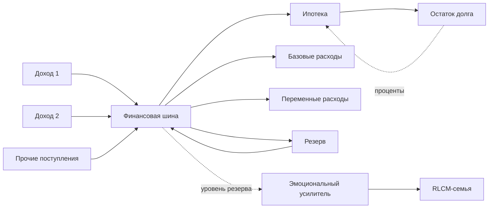

# RLC-FAMILY-6 — Финансовая шина, источники дохода и нагрузка

> **Статус:** сатирическая псевдонаучная модель.  
> В этой главе вводится отдельный финансовый контур. Он не заменяет «семейный ток взаимодействия» из ранних частей, а существует параллельно ему.

## 0. Почему деньги нельзя просто назвать током

В ранней RLC-family ток $I$ уже имеет канонический смысл:

$$
I_{\mathrm{rel}}
=
\text{реальный поток взаимодействия}.
$$

Поэтому денежный поток нельзя обозначать тем же самым $I$ без потери смысла.

Вводим отдельные финансовые переменные:

$$
M(t)
=
\text{денежный запас семьи},
$$

$$
J(t)
=
\frac{dM}{dt}
=
\text{чистый денежный поток}.
$$

Таким образом:

- $I_{\mathrm{rel}}$ — поток взаимодействия;
- $J_{\mathrm{fin}}$ — поток денег.

Это два разных контура, которые могут влиять друг на друга.

---

# Часть I. PWR1 — закон сохранения семейных денег

## 1. Финансовый баланс

Пусть семейная система имеет $n$ источников дохода и $m$ нагрузок.

Тогда:

$$
\frac{dM}{dt}
=
\sum_{k=1}^{n}S_k(t)
-
\sum_{j=1}^{m}L_j(t).
$$

Где:

- $S_k(t)$ — денежные источники;
- $L_j(t)$ — денежные нагрузки;
- $M(t)$ — текущий запас денежных средств.

### PWR1

**Деньги не обязаны исчезать бесследно: в минимальной модели они либо поступают, либо остаются в резерве, либо уходят в нагрузку.**

Если член

$$
L_{\mathrm{unknown}}
$$

становится большим, система обычно переходит в режим:

> «Куда опять делись деньги?»

---

## 2. Источник дохода

### SRC-MONEY1

Зарплата, прибыль, пособие, аренда, дивиденды и прочие поступления моделируются источниками денежного потока:

$$
S_{\mathrm{income}}(t).
$$

Регулярная зарплата — приблизительно периодический источник:

$$
S_{\mathrm{salary}}(t)
=
\sum_{k}
Q_s\,\delta(t-kT_s),
$$

где:

- $Q_s$ — сумма одного поступления;
- $T_s$ — период выплаты.

В бытовом приближении:

> источник работает импульсно, а нагрузка — практически непрерывно.

---

## 3. Несколько источников

Если доход получают несколько участников:

$$
S_{\mathrm{tot}}
=
S_1+S_2+\ldots+S_n.
$$

Это аналог параллельно подключённых источников к общей финансовой шине.

Но источники могут иметь разные:

- амплитуды;
- периоды;
- стабильность;
- внутреннее сопротивление;
- вероятность отказа.

Поэтому два источника по £2000 не эквивалентны одному идеальному источнику £4000 при различной надёжности.

---

# Часть II. LOAD1 — ипотека как нагрузка

## 4. Ипотека

Ипотека является одной из наиболее удобных почти стационарных нагрузок семейной финансовой сети.

В простейшем случае:

$$
L_{\mathrm{mort}}(t)
=
\sum_k
Q_m\,
\delta(t-kT_m),
$$

где:

- $Q_m$ — платёж;
- $T_m$ — период платежа.

В усреднённом режиме:

$$
\bar L_{\mathrm{mort}}
=
\frac{Q_m}{T_m}.
$$

### LOAD1

**Ипотека — периодическая обязательная нагрузка, которую система не может произвольно отключить без перехода в аварийный режим.**

Это отличает её от многих переменных расходов.

---

## 5. Базовая нагрузка и полезная нагрузка

Полную нагрузку представим как:

$$
L_{\mathrm{tot}}
=
L_{\mathrm{mort}}
+
L_{\mathrm{utilities}}
+
L_{\mathrm{food}}
+
L_{\mathrm{transport}}
+
L_{\mathrm{children}}
+
L_{\mathrm{optional}}.
$$

Вводим:

$$
L_{\mathrm{base}}
$$

— нагрузку, необходимую для поддержания системы;

и

$$
L_{\mathrm{optional}}
$$

— нагрузку, которую можно регулировать.

Если:

$$
S_{\mathrm{tot}}
<
L_{\mathrm{base}},
$$

система структурно дефицитна.

---

# Часть III. BUF1 — финансовый буфер

## 6. Денежный запас

Запас $M(t)$ играет роль буфера между импульсными источниками и непрерывными нагрузками.

Если:

$$
S(t)=0
$$

между двумя зарплатами, система продолжает питать нагрузку за счёт:

$$
M(t)>0.
$$

### BUF1

**Наличие финансового резерва снижает чувствительность семейного контура к временным провалам источника.**

---

## 7. Время автономной работы

Пусть доход внезапно исчезает:

$$
S(t)=0.
$$

При средней обязательной нагрузке:

$$
\bar L_{\mathrm{base}},
$$

время до исчерпания резерва приблизительно:

$$
T_{\mathrm{runway}}
=
\frac{M_0}{\bar L_{\mathrm{base}}}.
$$

В бытовой терминологии:

> сколько система может прожить после отключения питания.

---

## 8. Минимальный резерв

Введём порог:

$$
M_{\min}.
$$

При:

$$
M>M_{\min}
$$

система работает в нормальном финансовом режиме.

При:

$$
M\le M_{\min}
$$

начинают меняться параметры других подсистем:

- возрастает тревожность;
- усиливается чувствительность к шуму;
- уменьшается терпимость к внешним импульсам;
- растёт коэффициент эмоционального усилителя.

То есть финансовая шина начинает влиять на RLCM-контур.

---

# Часть IV. COUPLING1 — связь денег и семейной динамики

## 9. Финансовая нагрузка меняет параметры системы

Пусть коэффициент эмоционального усиления зависит от запаса:

$$
A=A(M).
$$

Один из возможных классов моделей:

$$
\frac{dA}{dM}<0.
$$

То есть при уменьшении финансового резерва система становится более чувствительной.

Это не универсальный психологический закон, а внутренняя гипотеза модели.

### COUPLING1

**Финансовый дефицит может не быть непосредственной причиной конфликта, но способен изменить коэффициенты усиления семейного контура.**

Бытовой перевод:

> тот же мусорный пакет при £5000 на счёте и при £5 на счёте — разные входные сигналы для системы.

---

# Часть V. DEBT1 — долг как динамическое состояние

## 10. Остаток долга

Ипотека — это не только текущая нагрузка.

Есть ещё состояние долга:

$$
D(t).
$$

Упрощённо:

$$
\frac{dD}{dt}
=
rD(t)-P(t),
$$

где:

- $rD$ — начисление процентов;
- $P(t)$ — погашение.

### DEBT1

**Ипотечная нагрузка имеет одновременно два уровня: текущий поток платежей и медленно меняющееся состояние долга.**

То есть:

$$
\text{mortgage}
=
\text{load}
+
\text{state}.
$$

Это связывает финансовую модель с RLC-FAMILY-3, где система уже приобрела память.

---

## 11. Процент как самогенерирующаяся нагрузка

Если платежи отсутствуют:

$$
P(t)=0,
$$

то при $r>0$:

$$
D(t)
=
D_0e^{rt}
$$

в простейшем непрерывном приближении.

Иными словами:

> отключение платежного тока не отключает ипотеку.

Наоборот, состояние продолжает эволюционировать.

---

# Часть VI. SURPLUS1 — избыток мощности

## 12. Финансовый профицит

Определим:

$$
J_{\mathrm{net}}
=
S_{\mathrm{tot}}
-
L_{\mathrm{tot}}.
$$

Если:

$$
J_{\mathrm{net}}>0,
$$

денежный запас растёт.

Если:

$$
J_{\mathrm{net}}=0,
$$

система находится в стационарном финансовом режиме.

Если:

$$
J_{\mathrm{net}}<0,
$$

резерв уменьшается.

### SURPLUS1

**Доход сам по себе не определяет устойчивость. Определяющей является разность между источником и нагрузкой.**

Поэтому семья с высоким доходом может находиться в дефиците, а семья с меньшим доходом — в устойчивом режиме.

---

# Часть VII. HEADROOM1 — финансовый запас по мощности

## 13. Свободная мощность

Введём финансовый headroom:

$$
H
=
S_{\mathrm{tot}}
-
L_{\mathrm{base}}.
$$

Если:

$$
H\gg0,
$$

система имеет свободу для:

- накопления;
- необязательных расходов;
- аварий;
- новых проектов;
- отпуска;
- внезапно сломавшейся стиральной машины.

Если:

$$
H\approx0,
$$

любая новая нагрузка становится существенным возмущением.

### HEADROOM1

**Стабильность определяется не только тем, выдерживает ли система текущую нагрузку, но и тем, сколько у неё остаётся запаса.**

---

# Часть VIII. INRUSH1 — пусковые токи семейных проектов

## 14. Не все нагрузки стационарны

Некоторые события дают кратковременную большую нагрузку:

- свадьба;
- переезд;
- ремонт;
- автомобиль;
- рождение ребёнка;
- первый месяц в новом доме.

Введём:

$$
L(t)
=
L_{\mathrm{steady}}
+
L_{\mathrm{inrush}}(t).
$$

### INRUSH1

**Система, устойчиво выдерживающая стационарную нагрузку, может не выдержать пусковой импульс.**

Это прямой финансовый аналог пускового тока.

---

# Часть IX. FAIL1 — отказ источника

## 15. Потеря дохода

Пусть один из источников отключается:

$$
S_k(t)\rightarrow0.
$$

Тогда:

$$
S_{\mathrm{tot}}'
=
S_{\mathrm{tot}}
-
S_k.
$$

Если после отказа:

$$
S_{\mathrm{tot}}'
<
L_{\mathrm{base}},
$$

система переходит на резерв.

### FAIL1

**Надёжность финансовой системы определяется не только суммарным доходом, но и устойчивостью к отказу отдельных источников.**

---

## 16. Резервирование

Два независимых источника:

$$
S_1,\;S_2
$$

дают более устойчивую архитектуру, чем один источник той же суммарной мощности, если их отказы слабо коррелированы.

Отсюда появляется понятие:

$$
N+1
$$

финансового резервирования.

Бытовой вариант:

> один доход питает систему, второй не даёт ей паниковать при отключении первого.

---

# Часть X. LOAD-SHED1 — сброс нагрузки

## 17. Приоритетное отключение

Когда:

$$
S_{\mathrm{tot}}<L_{\mathrm{tot}},
$$

система должна уменьшить нагрузку.

Но отключать все ветви одинаково бессмысленно.

Вводятся приоритеты:

1. критическая нагрузка;
2. обязательная;
3. полезная;
4. комфортная;
5. «непонятно зачем мы на это подписались».

### LOAD-SHED1

**При дефиците устойчивость повышается, если нагрузка сбрасывается по приоритетам, а не случайно.**

---

# Часть XI. Финансовая схема семейной сети

## 18. Архитектура PWR1

Это отдельная финансовая подсистема, связанная с основной семейной динамикой.

---

# Часть XII. Полный закон финансовой шины

## 19. Состояние системы

Минимальное финансовое состояние:

$$
z_{\mathrm{fin}}
=
\begin{bmatrix}
M\\
D
\end{bmatrix}.
$$

Динамика:

$$
\frac{dM}{dt}
=
S_{\mathrm{tot}}
-
L_{\mathrm{nonmort}}
-
P_{\mathrm{mort}},
$$

$$
\frac{dD}{dt}
=
rD
-
P_{\mathrm{principal}}.
$$

При этом семейные коэффициенты могут зависеть от финансового состояния:

$$
A=A(M,D),
$$

$$
\Theta=\Theta(M,D).
$$

То есть финансовый контур не просто считает деньги — он изменяет режим работы основной сети.

---

# Часть XIII. Канонические гипотезы RLC-FAMILY-6

### PWR1

Деньги образуют отдельный консервативный потоковый контур.

### SRC-MONEY1

Доходы моделируются источниками денежного потока.

### LOAD1

Ипотека является обязательной периодической нагрузкой.

### BUF1

Резерв является буфером между импульсными источниками и непрерывными нагрузками.

### COUPLING1

Финансовое состояние меняет параметры семейной динамики.

### DEBT1

Ипотека одновременно является текущей нагрузкой и состоянием долга.

### SURPLUS1

Устойчивость определяется чистым потоком, а не размером дохода отдельно.

### HEADROOM1

Критичен запас между доступным потоком и обязательной нагрузкой.

### INRUSH1

Крупные семейные события создают пусковые нагрузки.

### FAIL1

Отказ отдельного источника должен рассматриваться отдельно от суммарного дохода.

### LOAD-SHED1

При дефиците нагрузка должна отключаться по приоритетам.

---

# Часть XIV. Главный результат версии 6

Раньше ипотека была просто одной из нагрузок.

Теперь её место определено точнее:

$$
\boxed{
\text{ипотека}
=
\text{периодическая нагрузка}
+
\text{динамическое состояние долга}
}
$$

А поступление денег описывается независимо:

$$
\boxed{
\text{доход}
=
\text{источник денежного потока}
}
$$

Полный баланс:

$$
\boxed{
\frac{dM}{dt}
=
\sum S_{\mathrm{income}}
-
\sum L_{\mathrm{expenses}}
}
$$

Главный вывод:

> **Проблема может быть не в том, что нагрузка велика, а в том, что источник слаб, нестабилен или исчез не вовремя.**

И второй:

> **Высокий доход без запаса по мощности — это просто мощный источник, уже работающий на пределе.**

---

## 20. Следующий фронт

После PWR1 логично исследовать:

1. **GRID1** — совместная энергетика нескольких домохозяйств;
2. **CREDIT1** — кредит как внешний источник с будущей отрицательной нагрузкой;
3. **INVEST1** — инвестиции как ветвь с неопределённым коэффициентом возврата;
4. **INSURE1** — страховка как резервный источник, включающийся по условию;
5. **TAX1** — обязательная распределённая нагрузка уровня страны;
6. **CTRL1** — автоматическое управление бюджетом и семейной устойчивостью;
7. **RISK1** — вероятностные отказы источников и случайные нагрузки.

---

# Заключение

RLC-FAMILY-6 добавляет отсутствовавшую до сих пор финансовую физику.

Семья теперь имеет две принципиально разные шины:

$$
I_{\mathrm{rel}}
=
\text{поток взаимодействия},
$$

$$
J_{\mathrm{fin}}
=
\frac{dM}{dt}
=
\text{денежный поток}.
$$

Это позволяет не смешивать деньги с отношениями, но моделировать их связь.

Каноническая схема:

$$
\boxed{
\text{доход}
\rightarrow
\text{финансовая шина}
\rightarrow
\text{ипотека + базовые нагрузки + резерв}
}
$$

А связь с остальной теорией задаётся через состояние резерва и долга:

$$
(M,D)
\rightarrow
\text{параметры RLCM-системы}.
$$

Главная формулировка главы:

> **Ипотека — это нагрузка. Зарплата — источник. А спокойствие часто определяется тем, что осталось между ними.**

---

## Продолжение

**[RLC-FAMILY-7 — Оптофинансовая теория: лазерный денежный поток и финансовые резонаторы](RLC-FAMILY-7.md)**

Седьмая часть интерпретирует организованный денежный поток как лазерный свет: вводятся фотоприёмники, фототранзисторы возможностей, юстировка, финансовая оптика, потери, отражение, насыщение и бизнес как активная среда с порогом генерации.
