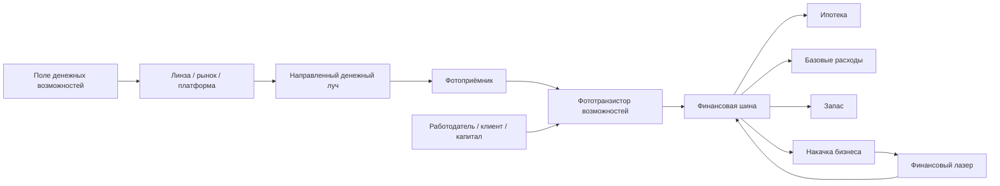

# RLC-FAMILY-7 — Оптофинансовая теория: лазерный денежный поток и финансовые резонаторы

> **Статус:** сатирическая псевдонаучная модель.  
> В этой главе деньги интерпретируются как направленный световой поток, а финансовая система — как оптическая сеть приёмников, каналов, резонаторов и нагрузок. Физические термины используются корректно в своей области, а финансовая интерпретация намеренно метафорична.

## 0. Основная замена

В RLC-FAMILY-6 деньги были оформлены как отдельный денежный поток

$$
J_{\mathrm{fin}}=\frac{dM}{dt}.
$$

Теперь вводится оптическое представление того же потока.

Каноническое соответствие:

$$
\boxed{
\text{денежный поток}
\longleftrightarrow
\text{направленный световой поток}
}
$$

Для организованного, направленного и предсказуемого денежного потока используем более сильную аналогию:

$$
\boxed{
\text{организованный денежный поток}
\longleftrightarrow
\text{лазерное излучение}
}
$$

Это не означает, что деньги физически являются светом. Это оптофинансовая модель передачи, концентрации и преобразования ресурса.

---

# Часть I. PHOTO1 — фотоприёмник денег

## 1. Приём денежного света

Пусть внешний финансовый поток задаётся условной оптической мощностью

$$
P_{\mathrm{money}}(t).
$$

Фотоприёмник характеризуется эффективностью

$$
\eta_{\mathrm{rx}}.
$$

Тогда принятая мощность:

$$
P_{\mathrm{received}}
=
\eta_{\mathrm{rx}}
P_{\mathrm{money}}.
$$

### PHOTO1

**Наличие денег в окружающей среде не гарантирует их поступления в конкретную систему; необходим приёмник и достаточное сопряжение с потоком.**

Отсюда:

> Можно жить в очень богатом поле и оставаться в финансовой темноте.

---

## 2. Фотодиод и фототранзистор

### Фотодиод

Фотодиод моделирует прямое обнаружение или преобразование внешнего денежного света.

Примеры:

- разовая выплата;
- подарок;
- грант;
- наследство;
- возврат средств.

### Фототранзистор

Фототранзистор интереснее.

Небольшой внешний световой сигнал не обязан сам нести основную выходную энергию.

Он может открыть значительно больший ток от отдельного источника питания.

В модели:

$$
J_{\mathrm{out}}
\approx
\beta J_{\mathrm{photo}},
$$

в пределах возможностей питающего источника.

### PHOTO2

**Малая внешняя возможность может открыть большой денежный поток, если система уже подключена к сильному источнику.**

Примеры:

- вакансия;
- новый клиент;
- контакт;
- заявка;
- тендер;
- реклама;
- рекомендация.

Главный принцип:

> **Фототранзистор денег не печатает. Он видит свет и открывает кран.**

---

# Часть II. BEAM1 — направленность денежного потока

## 3. Деньги должны попасть в приёмник

Пусть источник излучает мощность

$$
P_0.
$$

До приёмника доходит только часть:

$$
P_{\mathrm{rx}}
=
\eta_{\mathrm{geom}}
\eta_{\mathrm{path}}
P_0.
$$

Где:

- $\eta_{\mathrm{geom}}$ — геометрическое попадание;
- $\eta_{\mathrm{path}}$ — эффективность тракта.

### BEAM1

**Существование сильного финансового источника не гарантирует поступление средств, если луч направлен мимо приёмника.**

Бытовая формулировка:

> деньги в экономике есть; вопрос — светят ли они на тебя.

---

## 4. Коэффициент сопряжения

Введём:

$$
\eta_{\mathrm{coupling}}
=
\frac{P_{\mathrm{received}}}
{P_{\mathrm{available}}}.
$$

Если:

$$
\eta_{\mathrm{coupling}}\ll1,
$$

система получает малую долю доступного денежного света.

Причины:

- отсутствие нужного интерфейса;
- плохая юстировка;
- неподходящий рынок;
- неверная специализация;
- высокая потеря в промежуточных каналах.

---

# Часть III. ALIGN1 — юстировка финансовой оптики

## 5. Совпадение траекторий

Финансовая система может быть исправной, но плохо направленной.

Юстировка означает согласование:

- навыка;
- рынка;
- канала продаж;
- работодателя;
- клиента;
- платформы;
- времени.

### ALIGN1

**Доход определяется не только мощностью источника и качеством приёмника, но и точностью их пространственно-функционального совмещения.**

Неформально:

> отличный фотоприёмник в стороне от луча по-прежнему сидит в темноте.

---

# Часть IV. LENS1 — финансовая фокусировка

## 6. Линза

Линза собирает распределённый поток и концентрирует его.

В оптофинансовой модели линзами могут быть:

- бизнес;
- маркетплейс;
- фонд;
- банк;
- корпорация;
- платформа;
- посредник.

Слабые потоки:

$$
P_1,P_2,\ldots,P_n
$$

собираются в:

$$
P_{\mathrm{focus}}
\approx
\eta_f
\sum_{k=1}^{n}P_k.
$$

### LENS1

**Капитал и инфраструктура могут выполнять функцию финансовой оптики: собирать слабые распределённые потоки и направлять их в один канал.**

---

# Часть V. LOSS1 — потери и рассеяние

## 7. Затухание денежного луча

Пусть при прохождении канала:

$$
P(z)=P_0e^{-\alpha z}.
$$

Где $\alpha$ — условный коэффициент потерь.

Финансовые аналоги:

- комиссии;
- посредники;
- операционные расходы;
- потери эффективности;
- трение;
- налоги;
- ошибки маршрутизации.

### LOSS1

**Чем длиннее и сложнее денежный тракт, тем меньше исходной мощности может дойти до конечной нагрузки.**

Главный афоризм:

> **Не всякий миллион, вошедший в систему, доходит миллионером до нагрузки.**

---

# Часть VI. REFLECT1 — отражение денег

## 8. Деньги могут не войти

Даже при попадании луча на интерфейс часть мощности может отражаться.

В оптической аналогии:

$$
R=
\left|
\frac{n_1-n_2}{n_1+n_2}
\right|^2.
$$

Финансово это означает несовместимость сред:

- юридическую;
- банковскую;
- налоговую;
- контрактную;
- организационную.

### REFLECT1

**Часть доступного денежного потока может отражаться от интерфейса даже при наличии источника и приёмника.**

Пример:

> инвестор готов дать деньги, но структура сделки не пропускает луч.

---

# Часть VII. LASER1 — бизнес как финансовый лазер

## 9. Активная среда

Настоящий лазер требует:

- активной среды;
- накачки;
- обратной связи;
- резонатора;
- выходного канала.

Финансовая аналогия:

- активная среда — бизнес;
- накачка — вложенный ресурс;
- резонатор — повторяемый бизнес-процесс;
- стимулированное излучение — одна транзакция помогает породить следующую;
- выходное зеркало — прибыль, выходящая из системы.

### LASER1

**Устойчивый бизнес можно моделировать как финансовый лазер, который преобразует накачку в организованный выходной денежный поток.**

---

## 10. Порог генерации

Пока усиление за цикл меньше потерь:

$$
G_{\mathrm{rt}}
<
L_{\mathrm{rt}},
$$

самоподдерживающейся генерации нет.

При условии:

$$
G_{\mathrm{rt}}
>
L_{\mathrm{rt}},
$$

становится возможен устойчивый выходной поток.

Финансовая интерпретация:

> до порога бизнес требует внешней накачки; после порога цикл начинает поддерживать себя сам.

Неформально:

> **вкладываешь, вкладываешь, а лазер, сука, не светит.**

---

## 11. Резонатор

Пусть один бизнес-цикл:

$$
\text{клиент}
\rightarrow
\text{продажа}
\rightarrow
\text{маржа}
\rightarrow
\text{реинвестиция}
\rightarrow
\text{новый клиент}.
$$

Это финансовый round trip.

Если после полного цикла:

$$
P_{n+1}>P_n,
$$

система имеет усиление.

Если:

$$
P_{n+1}<P_n,
$$

поток затухает.

---

# Часть VIII. COHERENCE1 — когерентность денег

## 12. Случайный и организованный поток

Разовые поступления можно представить как некогерентное излучение:

- случайные продажи;
- редкие подработки;
- разовые переводы.

Регулярный поток:

- зарплата;
- подписка;
- долгосрочный контракт;
- повторные клиенты;

больше похож на когерентный источник.

### COHERENCE1

**Финансовая полезность потока зависит не только от средней мощности, но и от его временной предсказуемости и фазовой согласованности.**

Поэтому:

> £3000 регулярно может быть структурно устойчивее, чем случайные £6000.

---

# Часть IX. MORT-OPT1 — ипотека в оптической модели

## 13. Постоянно освещаемая нагрузка

Ипотека сохраняет статус обязательной нагрузки из RLC-FAMILY-6.

Теперь можно представить:

$$
P_{\mathrm{mort}}
=
\eta_{\mathrm{mort}}
P_{\mathrm{beam}}.
$$

Каждый финансовый период часть денежного луча поглощается ипотечной нагрузкой.

### MORT-OPT1

**Ипотека — оптически толстая нагрузка, стоящая непосредственно в основном денежном луче.**

Она обладает высоким приоритетом поглощения.

---

# Часть X. STORE1 — запас и поток

## 14. Деньги на счёте не равны денежному лучу

Нужно различать:

$$
M
=
\text{запас},
$$

и

$$
P_{\mathrm{money}}
=
\text{поток}.
$$

Деньги на счёте — уже захваченная системой энергия.

Зарплата — падающий луч.

Траты — поглощение.

Инвестиции — перенаправление части луча в активную среду.

### STORE1

**Высокий запас при нулевом потоке и высокий поток при нулевом запасе — принципиально разные финансовые состояния.**

---

# Часть XI. DARK1 — тёмный ток

## 15. Тёмный ток финансового приёмника

В фотодетекторах возможен ток даже без света.

В псевдомодели введём:

$$
J_{\mathrm{dark}}.
$$

Это поступления, которые продолжаются без явного нового внешнего сигнала:

- проценты;
- роялти;
- остаточные подписки;
- автоматические выплаты;
- старый актив.

### DARK1

**Некоторые финансовые системы сохраняют малый выход даже в темноте.**

Бытовой перевод:

> вроде ничего не делал, а £7.43 всё-таки пришло.

---

# Часть XII. SAT1 — насыщение финансового приёмника

## 16. Приёмник имеет предел

Даже если денежный свет увеличивается:

$$
P_{\mathrm{in}}\rightarrow\infty,
$$

выход системы может ограничиваться:

$$
P_{\mathrm{out}}\rightarrow P_{\max}.
$$

Причины:

- ограниченное время;
- ограниченная производительность;
- число сотрудников;
- физическая пропускная способность;
- ограничение рынка.

### SAT1

**Больше клиентов не всегда означает больше реализованного дохода, если приёмник уже насыщен.**

---

# Часть XIII. FULL-OPT — полная оптофинансовая схема

## 17. Архитектура

Теперь денежная система содержит одновременно:

- внешний свет;
- направленный луч;
- приём;
- управление;
- усиление;
- накопление;
- нагрузку;
- резонатор;
- генерацию.

---

# Часть XIV. Канонические гипотезы RLC-FAMILY-7

### PHOTO1

Для получения денежного потока необходим эффективный приёмник.

### PHOTO2

Малая внешняя возможность может открыть большой поток от другого источника.

### BEAM1

Сильный источник бесполезен, если луч проходит мимо.

### ALIGN1

Юстировка источника и приёмника критична для дохода.

### LENS1

Инфраструктура способна фокусировать множество слабых денежных потоков.

### LOSS1

Денежный тракт теряет мощность по мере прохождения через промежуточные элементы.

### REFLECT1

Несовместимый интерфейс отражает часть денежного потока.

### LASER1

Бизнес можно моделировать как финансовый лазер с накачкой, резонатором и выходным каналом.

### COHERENCE1

Предсказуемость денежного потока является отдельным качеством от его средней величины.

### MORT-OPT1

Ипотека остаётся приоритетной поглощающей нагрузкой.

### STORE1

Запас и поток должны моделироваться раздельно.

### DARK1

Некоторые системы дают остаточный поток даже без нового внешнего сигнала.

### SAT1

Финансовый приёмник имеет предел пропускной способности.

---

# Часть XV. Главный результат версии 7

Оптофинансовая модель добавляет к PWR1 новый уровень:

$$
\boxed{
\text{деньги должны не просто существовать — они должны быть направлены, приняты и преобразованы}
}
$$

Поэтому:

$$
\text{богатство среды}
\neq
\text{освещённость конкретного приёмника}.
$$

А полный путь денежного света:

$$
\boxed{
\text{источник}
\rightarrow
\text{направление}
\rightarrow
\text{юстировка}
\rightarrow
\text{приём}
\rightarrow
\text{преобразование}
\rightarrow
\text{нагрузка / запас / генерация}
}
$$

Главный афоризм:

> **Деньги должны не просто быть. Луч должен попасть в приёмник.**

И второй:

> **Хороший бизнес — это финансовый лазер: накачка вошла, резонатор заработал, и наружу пошёл организованный поток.**

---

## 18. Следующий исследовательский фронт

После PHOTO/LASER естественно исследовать:

1. **PRISM1** — спектральное разделение денежных потоков по источникам;
2. **FIBER1** — финансовые каналы с низкими потерями;
3. **CAVITY1** — накопление и добротность финансового резонатора;
4. **MODE1** — конкурирующие моды бизнеса;
5. **PULSE1** — разовые крупные денежные импульсы;
6. **NOISE-MONEY1** — финансовый шум и случайные поступления;
7. **OPT-NET1** — сеть финансовых лазеров, приёмников и нагрузок;
8. **GAIN1** — пределы устойчивого финансового усиления.

---

# Заключение

RLC-FAMILY-7 объединяет финансовую шину и оптическую аналогию.

В результате:

- деньги становятся направленным световым потоком;
- доходный канал — оптическим трактом;
- возможность — световым управляющим сигналом;
- фототранзистор — управляемым каналом дохода;
- рынок и инфраструктура — финансовой оптикой;
- ипотека — поглощающей нагрузкой;
- бизнес — активной средой и резонатором;
- устойчивый доход — организованным лазерным потоком.

Итоговая формулировка:

> **Можно иметь хороший приёмник, мощный источник и даже богатую среду — но без правильной юстировки финансовый лазер всё равно светит мимо.**
