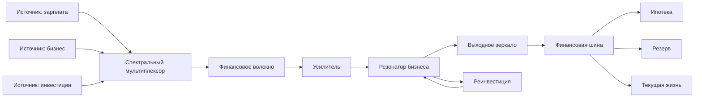

# RLC-FAMILY-8 — Финансовая фотоника: спектры, волокна, резонаторы и импульсные режимы

> **Статус:** сатирическая псевдонаучная модель.  
> Эта глава продолжает оптофинансовую интерпретацию RLC-FAMILY-7. Реальные идеи оптики и фотоники используются как математический и инженерный каркас; финансовая интерпретация является намеренной метафорой.

## 0. От лазера к фотонной системе

RLC-FAMILY-7 ввела:

$$
\text{денежный поток}
\longleftrightarrow
\text{световой поток},
$$

а организованный устойчивый доход — как лазерное излучение.

Но одиночный лазер ещё не образует полноценную оптическую систему.

Нужны:

- спектральное разделение;
- направляющие каналы;
- резонаторы;
- моды;
- импульсы;
- шум;
- усиление;
- многоканальные сети.

Поэтому версия 8 вводит финансовую фотонику.

---

# Часть I. PRISM1 — спектр денежных потоков

## 1. Деньги не обязаны быть «одного цвета»

Пусть полный денежный поток состоит из нескольких компонент:

$$
P_{\mathrm{money}}(\lambda)
=
\sum_k P_k(\lambda).
$$

В финансовой интерпретации условная «длина волны» кодирует тип источника.

Например:

- зарплата;
- бизнес;
- аренда;
- инвестиционный доход;
- разовая продажа;
- государственная выплата;
- подарок;
- возврат долга.

### PRISM1

**Совокупный доход может быть разложен на спектральные компоненты по происхождению и временной структуре.**

То есть одинаковая сумма денег может иметь разный спектр.

---

## 2. Финансовая призма

Призма разделяет смешанный свет по спектру.

В модели:

$$
P_{\mathrm{tot}}
\rightarrow
\{P_1,P_2,\ldots,P_n\}.
$$

Финансовый аналог — анализ доходов по источникам.

Например:

$$
P_{\mathrm{salary}}
+
P_{\mathrm{business}}
+
P_{\mathrm{investment}}
+
P_{\mathrm{random}}.
$$

### Следствие PRISM1-A

Система с тем же средним доходом может иметь совершенно другую устойчивость, если изменён спектральный состав.

> £4000 из одного источника и £4000 из пяти независимых источников — одинаковая сумма, но разный спектр риска.

---

# Часть II. FILTER-MONEY1 — спектральная фильтрация

## 3. Не все деньги одинаково доступны

Пусть финансовый фильтр имеет передаточную функцию:

$$
H_{\mathrm{fin}}(\lambda).
$$

Тогда:

$$
P_{\mathrm{out}}(\lambda)
=
H_{\mathrm{fin}}(\lambda)
P_{\mathrm{in}}(\lambda).
$$

Примеры фильтрации:

- юридическая допустимость;
- налоговый режим;
- требования банка;
- квалификация;
- география;
- время;
- риск-политика.

### FILTER-MONEY1

**Финансовая система может хорошо пропускать одни виды денежного потока и почти полностью подавлять другие.**

---

# Часть III. FIBER1 — финансовое оптоволокно

## 4. Канал с низкими потерями

Оптоволокно ценно тем, что способно передавать свет на большие расстояния с малыми потерями и контролируемой модовой структурой.

В финансовой модели:

$$
P(L)=P_0e^{-\alpha L}.
$$

Чем меньше $\alpha$, тем лучше канал.

Финансовыми «волокнами» могут быть:

- автоматический банковский перевод;
- прямой контракт;
- платёжный API;
- регулярное списание;
- зарплатный канал;
- программируемая финансовая инфраструктура.

### FIBER1

**Хороший денежный канал минимизирует потери и неопределённость между источником и нагрузкой.**

---

## 5. Соединители и стыки

Даже хорошее волокно теряет мощность на плохом соединении.

Пусть:

$$
\eta_{\mathrm{joint}}<1.
$$

После $N$ стыков:

$$
P_N
=
P_0
\prod_{k=1}^{N}\eta_k.
$$

Финансовая интерпретация:

- посредники;
- конвертации;
- комиссии;
- ручные этапы;
- бюрократия;
- повторные согласования.

### Следствие FIBER1-A

Малые потери на каждом этапе могут дать большую потерю на длинном маршруте.

---

# Часть IV. WDM1 — несколько потоков в одном канале

## 6. Спектральное мультиплексирование

В оптоволокне несколько длин волн могут передаваться одновременно.

В модели:

$$
P_{\mathrm{fiber}}
=
\sum_{k=1}^{N}P(\lambda_k).
$$

Финансовый аналог:

одна инфраструктура обслуживает сразу несколько денежных потоков.

Например один счёт принимает:

- зарплату;
- доход бизнеса;
- дивиденды;
- аренду;
- возвраты.

### WDM1

**Один финансовый канал может переносить множество независимых потоков, если система умеет их различать и маршрутизировать.**

---

# Часть V. CAVITY1 — финансовый резонатор

## 7. Денежная полость

Оптический резонатор удерживает поле между отражающими границами достаточно долго, чтобы происходило усиление определённых мод.

В финансовой модели резонатор — повторяющийся цикл:

$$
\text{доход}
\rightarrow
\text{реинвестиция}
\rightarrow
\text{рост}
\rightarrow
\text{новый доход}.
$$

Пусть за полный цикл мощность умножается на:

$$
G_{\mathrm{rt}}.
$$

Тогда:

- при $G_{\mathrm{rt}}<1$ поток затухает;
- при $G_{\mathrm{rt}}=1$ сохраняется;
- при $G_{\mathrm{rt}}>1$ растёт до ограничения нелинейностями.

### CAVITY1

**Повторяемая финансовая система становится резонатором, если часть выходного потока возвращается в цикл и участвует в следующем усилении.**

---

## 8. Добротность финансового резонатора

В физике добротность $Q$ характеризует отношение запасённой энергии к потерям.

В псевдомодели введём:

$$
Q_{\mathrm{fin}}
\sim
\frac{\text{капитал, сохраняемый в продуктивном цикле}}
{\text{потери за один цикл}}.
$$

### CAVITY1-A

Высокая финансовая добротность означает, что система долго сохраняет и многократно использует ресурс.

Но чрезмерная добротность может означать, что деньги прекрасно циркулируют внутри системы и почти не выходят владельцу.

Отсюда:

> **идеальный резонатор может быть прекрасным бизнесом и ужасным банкоматом.**

---

# Часть VI. OUTCOUPLE1 — выходное зеркало

## 9. Почему нельзя отражать всё

Лазерный резонатор требует частично прозрачного зеркала.

Если отражение:

$$
R=1,
$$

энергия остаётся внутри.

Если отражение слишком мало, резонатор не набирает достаточное поле.

Следовательно нужен оптимальный выходной коэффициент:

$$
0<T_{\mathrm{out}}<1.
$$

### OUTCOUPLE1

**Устойчивый бизнес должен одновременно реинвестировать часть потока и выводить часть наружу.**

Слишком большой вывод:

> бизнес перестаёт усиливаться.

Слишком маленький:

> бизнес растёт, а хозяин всё ещё ест доширак.

---

# Часть VII. MODE1 — конкурирующие моды бизнеса

## 10. Несколько способов зарабатывать внутри одного резонатора

Оптический резонатор может поддерживать несколько мод:

$$
M_1,M_2,\ldots,M_n.
$$

Финансовый аналог:

- подписка;
- разовые продажи;
- реклама;
- сервис;
- лицензирование;
- премиальный тариф.

Каждая мода имеет собственное усиление:

$$
G_k.
$$

### MODE1

**Бизнес может поддерживать несколько финансовых мод, конкурирующих за одну и ту же накачку.**

---

## 11. Конкуренция мод

Если один ресурс ограничен:

$$
P_{\mathrm{pump}}=\text{const},
$$

то рост одной моды может уменьшать усиление другой.

В простейшем виде:

$$
G_k
=
\frac{G_{k0}}
{1+\sum_j \alpha_{kj}P_j}.
$$

### Следствие MODE1-A

Самый яркий денежный канал может подавлять более слабые, даже если последние потенциально полезны.

Бытовой перевод:

> один удачный продукт способен съесть весь бизнес.

---

# Часть VIII. MODE-LOCK1 — синхронизация финансовых мод

## 12. Моды могут работать несогласованно

Если разные потоки не синхронизированы, доход распределён хаотично по времени.

Но если процессы согласованы:

- маркетинг;
- продажа;
- доставка;
- повторная продажа;
- подписка;

они могут создавать регулярные мощные пакеты.

### MODE-LOCK1

**Согласование нескольких финансовых мод по времени может создавать короткие интенсивные импульсы денежного потока.**

Это финансовый аналог mode locking.

---

# Часть IX. PULSE1 — импульсные деньги

## 13. Не всякий доход непрерывен

Пусть крупное поступление приходит в момент $t_0$:

$$
P(t)
=
E_p\delta(t-t_0).
$$

Примеры:

- бонус;
- продажа автомобиля;
- продажа бизнеса;
- наследство;
- крупный контракт;
- страховая выплата.

### PULSE1

**Крупный денежный импульс может иметь высокую мгновенную мощность, но не создавать устойчивого среднего дохода.**

---

## 14. Энергия импульса и средняя мощность

Пусть один импульс несёт:

$$
E_p.
$$

Если он повторяется раз в период $T$, средняя мощность:

$$
\bar P
=
\frac{E_p}{T}.
$$

Поэтому:

> £60 000 один раз в пять лет и £1000 каждый месяц могут иметь близкую среднюю величину, но совершенно разную динамику системы.

---

# Часть X. PEAK1 — опасность пиковой мощности

## 15. Большой импульс способен перегрузить систему

Даже полезный финансовый импульс может создать проблемы:

- нерациональное распределение;
- резкий рост расходов;
- ошибочное ощущение нового стационарного режима;
- перегрузку инвестиционного канала.

### PEAK1

**Высокая пиковая денежная мощность не эквивалентна высокой устойчивой мощности.**

Отсюда:

> большая сумма на счёте ещё не означает, что лазер наконец заработал.

Возможно, это просто вспышка.

---

# Часть XI. NOISE-MONEY1 — финансовый шум

## 16. Случайные поступления

Пусть:

$$
P(t)
=
P_{\mathrm{signal}}(t)
+
n_{\mathrm{money}}(t).
$$

К шуму можно отнести:

- случайные мелкие продажи;
- нерегулярные возвраты;
- неожиданные комиссии со знаком плюс;
- кэшбэк;
- разовые бонусы;
- мелкие случайные поступления.

### NOISE-MONEY1

**Шум может увеличивать наблюдаемую среднюю величину дохода, не увеличивая его предсказуемость.**

---

## 17. Финансовый SNR

Определим:

$$
\mathrm{SNR}_{\mathrm{money}}
=
\frac{P_{\mathrm{predictable}}}
{P_{\mathrm{random}}}.
$$

Большой средний доход при низком SNR может быть хуже для планирования, чем меньший, но устойчивый поток.

---

# Часть XII. AMPLIFIER1 — финансовый усилитель

## 18. Коэффициент усиления

Пусть входная мощность:

$$
P_{\mathrm{in}},
$$

а выход:

$$
P_{\mathrm{out}}
=
G P_{\mathrm{in}}.
$$

Тогда:

$$
G>1
$$

означает усиление.

Финансовые аналоги:

- бизнес;
- инвестиционный механизм;
- автоматизация;
- масштабируемая технология;
- сеть продаж.

### GAIN1

**Усилитель не создаёт ресурс из ничего; он требует накачки и среды, способной преобразовать её в дополнительный выходной поток.**

---

## 19. Насыщение усилителя

При малом сигнале:

$$
P_{\mathrm{out}}\approx GP_{\mathrm{in}}.
$$

Но при росте входа:

$$
G\rightarrow G(P_{\mathrm{in}}),
$$

и эффективное усиление уменьшается.

### GAIN1-A

Бизнес с коэффициентом роста 5× на малом масштабе не обязан сохранять 5× после увеличения потока в сто раз.

---

# Часть XIII. FIBER-NET1 — сеть денежных каналов

## 20. Оптическая сеть

Теперь можно соединить:

- источники;
- линзы;
- фильтры;
- волокна;
- усилители;
- резонаторы;
- нагрузки.

### OPT-NET1

**Финансовая устойчивость определяется не отдельным элементом, а архитектурой всего оптического тракта.**

---

# Часть XIV. Канонические гипотезы RLC-FAMILY-8

### PRISM1

Доход имеет спектральную структуру по источникам.

### FILTER-MONEY1

Финансовая система избирательно пропускает разные типы дохода.

### FIBER1

Низкопотерный канал повышает долю исходного денежного потока, достигающего нагрузки.

### WDM1

Один финансовый канал может переносить несколько независимых потоков.

### CAVITY1

Повторяемый бизнес-цикл действует как финансовый резонатор.

### OUTCOUPLE1

Устойчивый резонатор требует баланса реинвестирования и вывода прибыли.

### MODE1

Разные модели дохода конкурируют за одну накачку.

### MODE-LOCK1

Синхронизация бизнес-процессов способна формировать интенсивные денежные импульсы.

### PULSE1

Крупное поступление не эквивалентно устойчивому денежному потоку.

### PEAK1

Пиковая мощность и средняя мощность должны рассматриваться отдельно.

### NOISE-MONEY1

Нерегулярные поступления являются финансовым шумом.

### GAIN1

Финансовое усиление ограничено накачкой, потерями и насыщением.

### OPT-NET1

Полная финансовая система является сетью оптических элементов, а не одним лазером.

---

# Часть XV. Главный результат версии 8

RLC-FAMILY-7 утверждала:

> деньги должны не просто существовать — луч должен попасть в приёмник.

Версия 8 добавляет:

> **после попадания луча ещё нужно правильно провести его через всю систему.**

Полный путь:

$$
\boxed{
\text{источник}
\rightarrow
\text{спектр}
\rightarrow
\text{фильтр}
\rightarrow
\text{волокно}
\rightarrow
\text{усилитель}
\rightarrow
\text{резонатор}
\rightarrow
\text{выход}
\rightarrow
\text{нагрузка}
}
$$

Поэтому финансовая проблема может находиться:

- не в мощности источника;
- не в приёмнике;
- не в бизнесе;
- а в стыке, моде, фильтре, потерях, насыщении или неправильном выходном зеркале.

Главный афоризм:

> **Иногда денег мало не потому, что лазер слабый, а потому что половина света теряется в оптике.**

---

## 21. Следующий исследовательский фронт

После финансовой фотоники становятся естественными:

1. **GRID1** — большая сеть семейных и бизнес-контуров;
2. **ROUTER1** — маршрутизация денежных потоков;
3. **CREDIT1** — кредит как внешний импульс с отрицательным будущим хвостом;
4. **INVEST1** — вероятностный усилитель с риском потерь;
5. **INSURE1** — резервный источник, включаемый условием;
6. **TAX1** — распределённая обязательная нагрузка;
7. **CTRL1** — управление финансовой сетью;
8. **CHAOS-FIN1** — нелинейные режимы многоканальной финансовой системы.

---

# Заключение

RLC-FAMILY-8 превращает финансовый лазер из одиночного образа в полноценную оптическую систему.

Теперь теория различает:

- цвет денег;
- качество канала;
- спектральную фильтрацию;
- потери;
- резонатор;
- добротность;
- конкурирующие моды;
- импульсные поступления;
- финансовый шум;
- насыщение усилителя.

Итог:

> **Деньги — это не только сколько света пришло. Это ещё какой это свет, по какому каналу он пришёл, сколько потерялось, что усилилось и сколько удалось вывести из резонатора наружу.**
